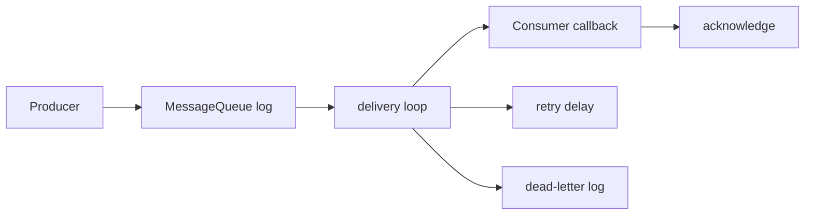
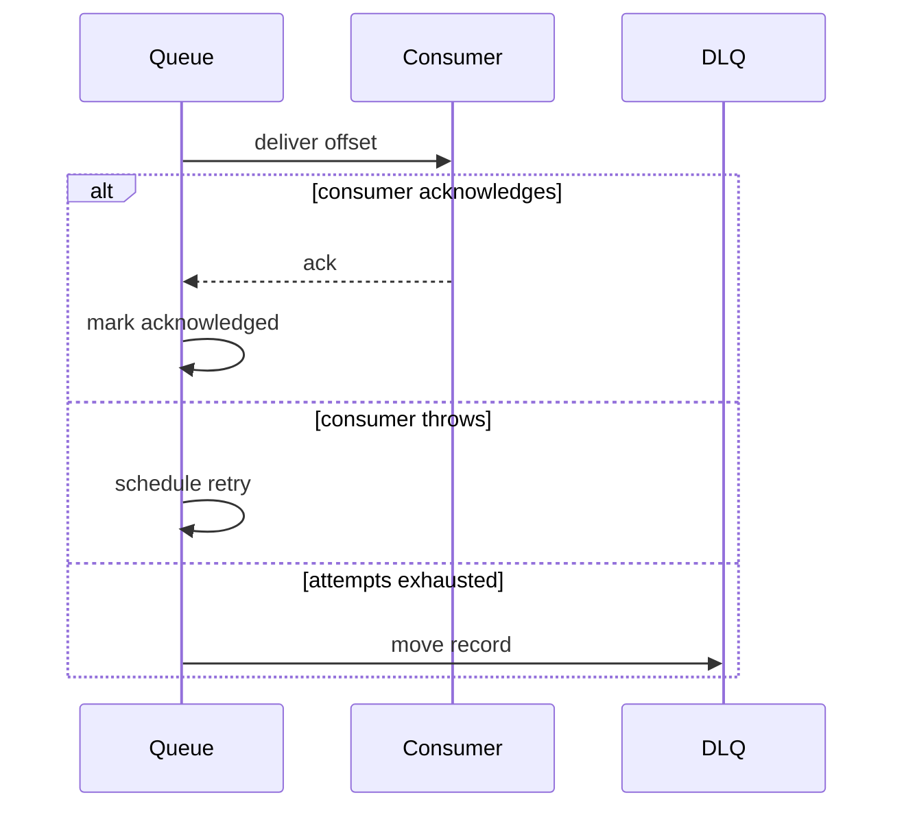
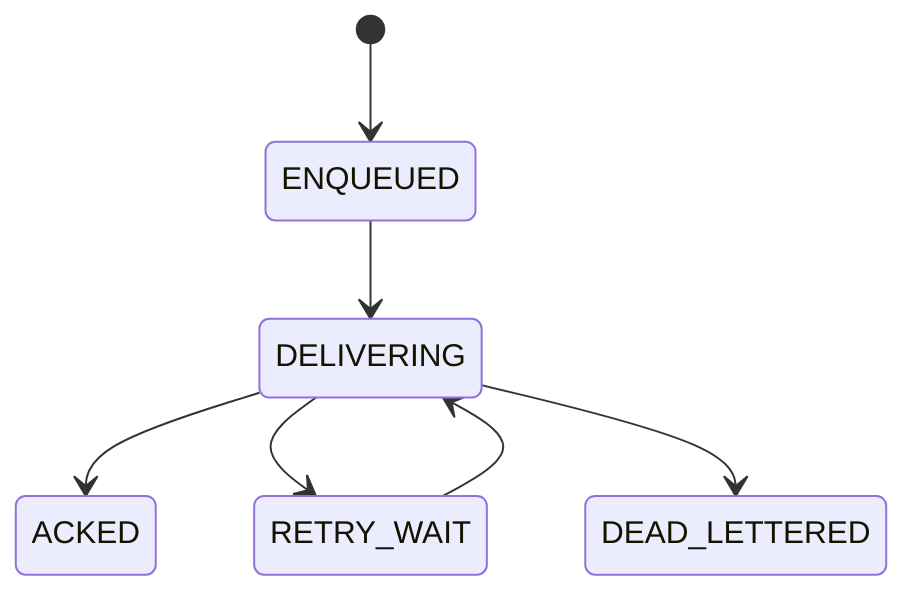

# Message Queue Lab Diagrams

## High-Level Design

### Component View

```mermaid
flowchart LR
    Producer["Producer"] --> Queue["MessageQueue log"]
    Queue --> Delivery["delivery loop"]
    Delivery --> Consumer["Consumer callback"]
    Consumer --> Ack["acknowledge"]
    Delivery --> Retry["retry delay"]
    Delivery --> DLQ["dead-letter log"]
```

## Low-Level Design

### Delivery Flow

```mermaid
sequenceDiagram
    participant Q as Queue
    participant C as Consumer
    participant D as DLQ
    Q->>C: deliver offset
    alt consumer acknowledges
        C-->>Q: ack
        Q->>Q: mark acknowledged
    else consumer throws
        Q->>Q: schedule retry
    else attempts exhausted
        Q->>D: move record
    end
```

### Message State Flow

```mermaid
stateDiagram-v2
    [*] --> ENQUEUED
    ENQUEUED --> DELIVERING
    DELIVERING --> ACKED
    DELIVERING --> RETRY_WAIT
    RETRY_WAIT --> DELIVERING
    DELIVERING --> DEAD_LETTERED
```
