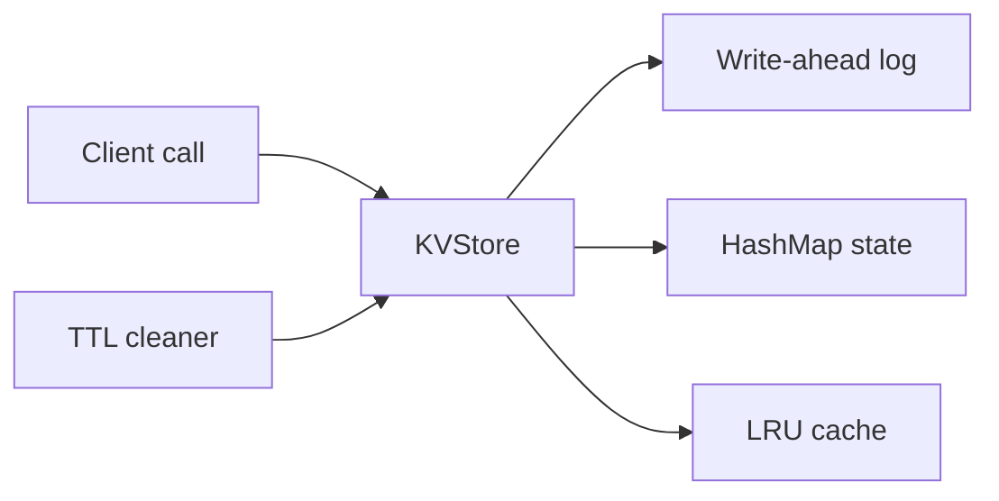
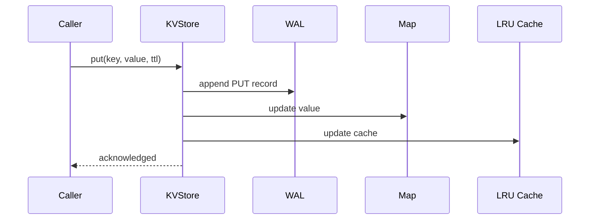
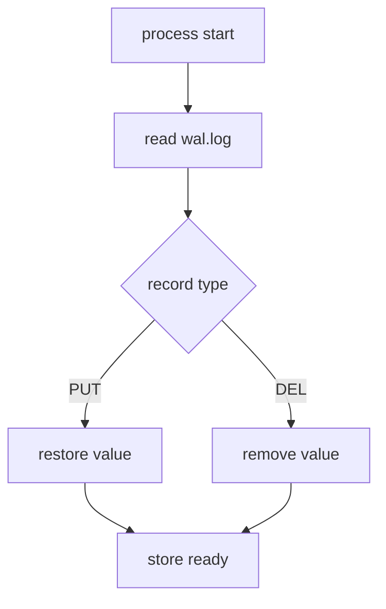

# Mini KV Storage Engine Diagrams

## High-Level Design

### Component View

```mermaid
flowchart LR
    Client["Client call"] --> Store["KVStore"]
    Store --> WAL["Write-ahead log"]
    Store --> Mem["HashMap state"]
    Store --> Cache["LRU cache"]
    Cleaner["TTL cleaner"] --> Store
```

## Low-Level Design

### Write Path

```mermaid
sequenceDiagram
    participant C as Caller
    participant S as KVStore
    participant W as WAL
    participant M as Map
    participant L as LRU Cache
    C->>S: put(key, value, ttl)
    S->>W: append PUT record
    S->>M: update value
    S->>L: update cache
    S-->>C: acknowledged
```

### Recovery Flow

```mermaid
flowchart TB
    Start["process start"] --> Read["read wal.log"]
    Read --> Replay{"record type"}
    Replay -->|PUT| Put["restore value"]
    Replay -->|DEL| Del["remove value"]
    Put --> Ready["store ready"]
    Del --> Ready
```
