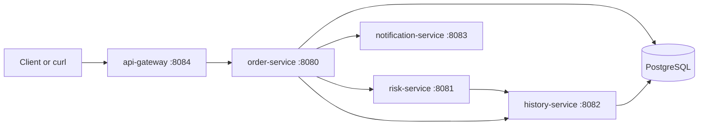

# Mini Nasdaq Risk Platform

A single learning project for backend production fundamentals: HTTP microservices, PostgreSQL persistence, Docker Compose, Kubernetes on Minikube, service discovery, config, secrets, resource limits, and failure drills.

## Architecture



`order-service` accepts orders and stores the final status. `risk-service` checks configured limits and asks `history-service` for current exposure. `history-service` stores immutable order events and aggregated exposures in PostgreSQL. `notification-service` records recent rejection or large-order alerts. `api-gateway` provides one `/api` entry point.

For a focused live interview demo of the Nasdaq-style pre-trade flow, use the standalone `pretrade-risk-engine` module. It runs on port `8090` and includes a browser dashboard, FIX parser, in-memory risk state, atomic reservation, kill switch, circuit breaker, audit trail, race-condition demo, and real-time P&L.

## Local Build

Prerequisites:

- Java 17
- Maven 3.9+
- Docker Desktop for Compose and Minikube workflows
- Minikube and kubectl for Kubernetes drills

Verify the Java code:

```powershell
mvn clean verify
```

Run only the live pre-trade risk engine demo:

```powershell
mvn -pl pretrade-risk-engine spring-boot:run
```

Then open `http://localhost:8090`.

Run with Docker Compose:

```powershell
docker compose up --build
```

Submit an accepted order through the gateway:

```powershell
Invoke-RestMethod -Method Post `
  -Uri http://localhost:8084/api/orders `
  -ContentType 'application/json' `
  -Body '{"clientId":"CLIENT-A","symbol":"MSFT","side":"BUY","quantity":100,"price":410.25}'
```

Submit a rejected order:

```powershell
Invoke-RestMethod -Method Post `
  -Uri http://localhost:8084/api/orders `
  -ContentType 'application/json' `
  -Body '{"clientId":"CLIENT-A","symbol":"MSFT","side":"BUY","quantity":20000,"price":410.25}'
```

Inspect state:

```powershell
Invoke-RestMethod http://localhost:8084/api/exposures
Invoke-RestMethod http://localhost:8084/api/alerts
```

## Kubernetes on Minikube

Build local images inside Minikube's Docker daemon:

```powershell
minikube start
minikube addons enable ingress
minikube docker-env | Invoke-Expression
docker compose build
```

Deploy:

```powershell
kubectl apply -k k8s
kubectl get pods -n mini-risk -w
```

Use port-forwarding if you do not want to edit hosts:

```powershell
kubectl port-forward -n mini-risk service/api-gateway 8084:8084
```

For ingress, map `mini-risk.local` to the Minikube IP:

```powershell
minikube ip
```

Then add the IP to your hosts file and call `http://mini-risk.local/api/orders`.

## Failure Drills

See [docs/failure-drills.md](docs/failure-drills.md) for pod kills, bad configs, memory pressure, replica scaling, and volume deletion drills.

## Useful Ports

- `8084`: api-gateway
- `8080`: order-service
- `8081`: risk-service
- `8082`: history-service
- `8083`: notification-service
- `5432`: PostgreSQL
