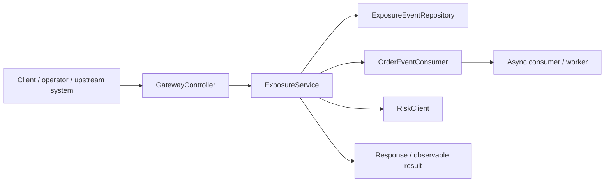
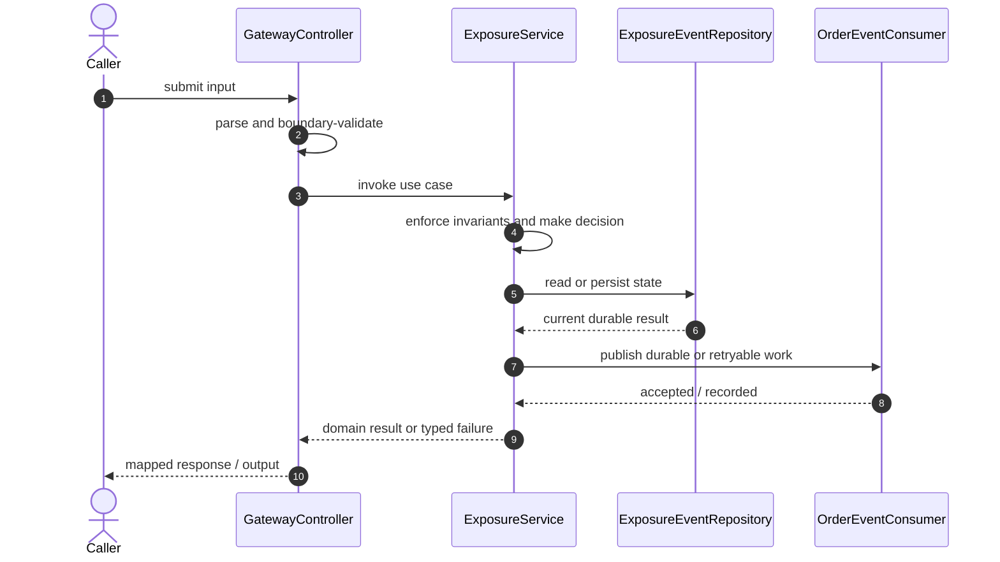

# Mini Risk Management Platform Code Flow

This is the single code-flow guide for the project. It connects the business request to concrete source files, explains both architectural levels, and shows where validation, state changes, asynchronous work, and responses occur.

## Scope and outcome

A production engineering interview lab inspired by a simplified pre-trade risk platform.

The tracked production-code inventory used by this guide contains **41 source units** and **9 annotation-discovered HTTP operations**. Generated/build output and test sources are intentionally excluded from the runtime path.

## High-Level Design

At the system level, callers enter through an inbound adapter. The adapter owns transport concerns; application/domain code owns use-case decisions; repositories and gateways isolate state and external systems. Asynchronous adapters extend the flow without moving business invariants into controllers or consumers.

### Runtime stages

1. **Enter:** a request, command, scheduled trigger, protocol message, or UI action reaches the inbound boundary.
2. **Validate:** transport shape and required fields are rejected before domain mutation.
3. **Decide:** application/domain logic loads required state and applies invariants, idempotency, authorization, limits, or algorithms.
4. **Commit:** durable state changes pass through a repository/store; external calls pass through gateways; asynchronous work passes through message boundaries.
5. **Return and observe:** the adapter maps the result to an HTTP response, protocol response, CLI output, event, or metric.

## Low-Level Design

The low-level path keeps orchestration directional: inbound adapter → application/domain unit → persistence/outbound adapter. Contracts carry data between layers; configuration and security apply cross-cutting policy without becoming business logic.

### Component map

| Responsibility           | Concrete code                                                                                                                                                             |
| ------------------------ | ------------------------------------------------------------------------------------------------------------------------------------------------------------------------- |
| Entry point              | `ApiGatewayApplication`, `HistoryServiceApplication`, `NotificationServiceApplication`, `OrderServiceApplication`, `RiskServiceApplication`                               |
| Inbound adapter          | `GatewayController`, `ExposureController`, `OrderController`, `RiskController`                                                                                            |
| Configuration/security   | `RestClientConfig`, `KafkaTopicConfig`, `RestClientConfig`, `RestClientConfig`                                                                                            |
| API/message contract     | `ExposureEvent`, `OrderEvent`, `OrderRequest`, `OrderResponse`, `RiskCheckRequest`, `RiskCheckResponse`                                                                   |
| Messaging/async adapter  | `OrderEventConsumer`, `OrderNotificationConsumer`, `OrderEventPublisher`                                                                                                  |
| Domain/data model        | `ExposureAggregate`, `OrderEntity`                                                                                                                                        |
| Persistence adapter      | `ExposureEventRepository`, `OrderRepository`, `RiskLimitRepository`                                                                                                       |
| Application/domain logic | `ExposureService`, `OrderApplicationService`, `RiskEvaluationService`                                                                                                     |
| Supporting logic         | `NotificationFormatter`, `ClientHttpRequestFactories`, `RiskLimit`, `RiskLimitLookup`, `RiskLimitSnapshot`, `ExposureSummary`, `OrderSide`, `OrderStatus`, `RiskDecision` |
| Outbound adapter         | `RiskClient`, `HistoryClient`                                                                                                                                             |

### Inbound operations

| Verb/trigger | Path or input                    | Owning code          |
| ------------ | -------------------------------- | -------------------- |
| `POST`       | `/orders`                        | `GatewayController`  |
| `GET`        | `/orders/{orderId}`              | `GatewayController`  |
| `GET`        | `/exposures/{clientId}/{symbol}` | `GatewayController`  |
| `GET`        | `/exposures/{clientId}`          | `GatewayController`  |
| `GET`        | `/{clientId}/{symbol}`           | `ExposureController` |
| `GET`        | `/{clientId}`                    | `ExposureController` |
| `POST`       | `(class-level/default path)`     | `OrderController`    |
| `GET`        | `/{orderId}`                     | `OrderController`    |
| `POST`       | `/check`                         | `RiskController`     |

## Detailed source walkthrough

Read this table top-down by category, then follow the linked files. “Key methods” are discovered from the checked-in implementation and identify useful debugging/interview entry points.

| Source file                                                                                                                                     | Role                     | Responsibility and important methods                                                                                                                                                                          |
| ----------------------------------------------------------------------------------------------------------------------------------------------- | ------------------------ | ------------------------------------------------------------------------------------------------------------------------------------------------------------------------------------------------------------- |
| [`ApiGatewayApplication.java`](./api-gateway/src/main/java/com/example/risk/gateway/ApiGatewayApplication.java)                                 | Entry point              | ApiGatewayApplication bootstraps the process and wires the runtime. Key methods: `main()`.                                                                                                                    |
| [`GatewayController.java`](./api-gateway/src/main/java/com/example/risk/gateway/api/GatewayController.java)                                     | Inbound adapter          | GatewayController accepts an inbound call, validates its boundary contract, and delegates work.                                                                                                               |
| [`RestClientConfig.java`](./api-gateway/src/main/java/com/example/risk/gateway/config/RestClientConfig.java)                                    | Configuration/security   | RestClientConfig defines runtime wiring, authentication, authorization, or cross-cutting policy.                                                                                                              |
| [`HistoryServiceApplication.java`](./history-service/src/main/java/com/example/risk/history/HistoryServiceApplication.java)                     | Entry point              | HistoryServiceApplication bootstraps the process and wires the runtime. Key methods: `main()`.                                                                                                                |
| [`ExposureController.java`](./history-service/src/main/java/com/example/risk/history/api/ExposureController.java)                               | Inbound adapter          | ExposureController accepts an inbound call, validates its boundary contract, and delegates work.                                                                                                              |
| [`ExposureEvent.java`](./history-service/src/main/java/com/example/risk/history/domain/ExposureEvent.java)                                      | API/message contract     | ExposureEvent carries validated data across an API or messaging boundary. Key methods: `getId()`, `getOrderId()`, `getClientId()`, `getSymbol()`, `getSide()`, `getQuantity()`.                               |
| [`OrderEventConsumer.java`](./history-service/src/main/java/com/example/risk/history/messaging/OrderEventConsumer.java)                         | Messaging/async adapter  | OrderEventConsumer publishes, consumes, retries, or records asynchronous work.                                                                                                                                |
| [`ExposureAggregate.java`](./history-service/src/main/java/com/example/risk/history/repository/ExposureAggregate.java)                          | Domain/data model        | ExposureAggregate represents domain state, identity, or an invariant-bearing value.                                                                                                                           |
| [`ExposureEventRepository.java`](./history-service/src/main/java/com/example/risk/history/repository/ExposureEventRepository.java)              | Persistence adapter      | ExposureEventRepository reads or writes durable state behind a storage boundary.                                                                                                                              |
| [`ExposureService.java`](./history-service/src/main/java/com/example/risk/history/service/ExposureService.java)                                 | Application/domain logic | ExposureService coordinates the use case and enforces domain decisions. Key methods: `record()`, `summary()`, `recent()`.                                                                                     |
| [`NotificationServiceApplication.java`](./notification-service/src/main/java/com/example/risk/notification/NotificationServiceApplication.java) | Entry point              | NotificationServiceApplication bootstraps the process and wires the runtime. Key methods: `main()`.                                                                                                           |
| [`OrderNotificationConsumer.java`](./notification-service/src/main/java/com/example/risk/notification/messaging/OrderNotificationConsumer.java) | Messaging/async adapter  | OrderNotificationConsumer publishes, consumes, retries, or records asynchronous work.                                                                                                                         |
| [`NotificationFormatter.java`](./notification-service/src/main/java/com/example/risk/notification/service/NotificationFormatter.java)           | Supporting logic         | NotificationFormatter provides a focused algorithm or shared implementation detail. Key methods: `format()`.                                                                                                  |
| [`OrderServiceApplication.java`](./order-service/src/main/java/com/example/risk/order/OrderServiceApplication.java)                             | Entry point              | OrderServiceApplication bootstraps the process and wires the runtime. Key methods: `main()`.                                                                                                                  |
| [`OrderController.java`](./order-service/src/main/java/com/example/risk/order/api/OrderController.java)                                         | Inbound adapter          | OrderController accepts an inbound call, validates its boundary contract, and delegates work.                                                                                                                 |
| [`RiskClient.java`](./order-service/src/main/java/com/example/risk/order/client/RiskClient.java)                                                | Outbound adapter         | RiskClient calls an external system through an isolated integration boundary. Key methods: `check()`.                                                                                                         |
| [`ClientHttpRequestFactories.java`](./order-service/src/main/java/com/example/risk/order/config/ClientHttpRequestFactories.java)                | Supporting logic         | ClientHttpRequestFactories provides a focused algorithm or shared implementation detail.                                                                                                                      |
| [`KafkaTopicConfig.java`](./order-service/src/main/java/com/example/risk/order/config/KafkaTopicConfig.java)                                    | Configuration/security   | KafkaTopicConfig defines runtime wiring, authentication, authorization, or cross-cutting policy.                                                                                                              |
| [`RestClientConfig.java`](./order-service/src/main/java/com/example/risk/order/config/RestClientConfig.java)                                    | Configuration/security   | RestClientConfig defines runtime wiring, authentication, authorization, or cross-cutting policy.                                                                                                              |
| [`OrderEntity.java`](./order-service/src/main/java/com/example/risk/order/domain/OrderEntity.java)                                              | Domain/data model        | OrderEntity represents domain state, identity, or an invariant-bearing value. Key methods: `getId()`, `getClientId()`, `getSymbol()`, `getSide()`, `getQuantity()`, `getPrice()`.                             |
| [`OrderEventPublisher.java`](./order-service/src/main/java/com/example/risk/order/messaging/OrderEventPublisher.java)                           | Messaging/async adapter  | OrderEventPublisher publishes, consumes, retries, or records asynchronous work. Key methods: `publish()`.                                                                                                     |
| [`OrderRepository.java`](./order-service/src/main/java/com/example/risk/order/repository/OrderRepository.java)                                  | Persistence adapter      | OrderRepository reads or writes durable state behind a storage boundary.                                                                                                                                      |
| [`OrderApplicationService.java`](./order-service/src/main/java/com/example/risk/order/service/OrderApplicationService.java)                     | Application/domain logic | OrderApplicationService coordinates the use case and enforces domain decisions. Key methods: `accept()`, `find()`.                                                                                            |
| [`RiskServiceApplication.java`](./risk-service/src/main/java/com/example/risk/risk/RiskServiceApplication.java)                                 | Entry point              | RiskServiceApplication bootstraps the process and wires the runtime. Key methods: `main()`.                                                                                                                   |
| [`RiskController.java`](./risk-service/src/main/java/com/example/risk/risk/api/RiskController.java)                                             | Inbound adapter          | RiskController accepts an inbound call, validates its boundary contract, and delegates work.                                                                                                                  |
| [`HistoryClient.java`](./risk-service/src/main/java/com/example/risk/risk/client/HistoryClient.java)                                            | Outbound adapter         | HistoryClient calls an external system through an isolated integration boundary. Key methods: `exposure()`.                                                                                                   |
| [`RestClientConfig.java`](./risk-service/src/main/java/com/example/risk/risk/config/RestClientConfig.java)                                      | Configuration/security   | RestClientConfig defines runtime wiring, authentication, authorization, or cross-cutting policy.                                                                                                              |
| [`RiskLimit.java`](./risk-service/src/main/java/com/example/risk/risk/domain/RiskLimit.java)                                                    | Supporting logic         | RiskLimit provides a focused algorithm or shared implementation detail. Key methods: `getId()`, `getClientId()`, `getSymbol()`, `getMaxOrderQuantity()`, `getMaxPositionQuantity()`, `getMaxDailyExposure()`. |
| [`RiskLimitRepository.java`](./risk-service/src/main/java/com/example/risk/risk/repository/RiskLimitRepository.java)                            | Persistence adapter      | RiskLimitRepository reads or writes durable state behind a storage boundary.                                                                                                                                  |
| [`RiskEvaluationService.java`](./risk-service/src/main/java/com/example/risk/risk/service/RiskEvaluationService.java)                           | Application/domain logic | RiskEvaluationService coordinates the use case and enforces domain decisions. Key methods: `evaluate()`.                                                                                                      |
| [`RiskLimitLookup.java`](./risk-service/src/main/java/com/example/risk/risk/service/RiskLimitLookup.java)                                       | Supporting logic         | RiskLimitLookup provides a focused algorithm or shared implementation detail. Key methods: `find()`.                                                                                                          |
| [`RiskLimitSnapshot.java`](./risk-service/src/main/java/com/example/risk/risk/service/RiskLimitSnapshot.java)                                   | Supporting logic         | RiskLimitSnapshot provides a focused algorithm or shared implementation detail. Key methods: `from()`.                                                                                                        |
| [`ExposureSummary.java`](./shared/src/main/java/com/example/risk/common/ExposureSummary.java)                                                   | Supporting logic         | ExposureSummary provides a focused algorithm or shared implementation detail. Key methods: `zero()`.                                                                                                          |
| [`OrderEvent.java`](./shared/src/main/java/com/example/risk/common/OrderEvent.java)                                                             | API/message contract     | OrderEvent carries validated data across an API or messaging boundary.                                                                                                                                        |
| [`OrderRequest.java`](./shared/src/main/java/com/example/risk/common/OrderRequest.java)                                                         | API/message contract     | OrderRequest carries validated data across an API or messaging boundary. Key methods: `notional()`.                                                                                                           |
| [`OrderResponse.java`](./shared/src/main/java/com/example/risk/common/OrderResponse.java)                                                       | API/message contract     | OrderResponse carries validated data across an API or messaging boundary.                                                                                                                                     |
| [`OrderSide.java`](./shared/src/main/java/com/example/risk/common/OrderSide.java)                                                               | Supporting logic         | OrderSide provides a focused algorithm or shared implementation detail.                                                                                                                                       |
| [`OrderStatus.java`](./shared/src/main/java/com/example/risk/common/OrderStatus.java)                                                           | Supporting logic         | OrderStatus provides a focused algorithm or shared implementation detail.                                                                                                                                     |
| [`RiskCheckRequest.java`](./shared/src/main/java/com/example/risk/common/RiskCheckRequest.java)                                                 | API/message contract     | RiskCheckRequest carries validated data across an API or messaging boundary. Key methods: `notional()`.                                                                                                       |
| [`RiskCheckResponse.java`](./shared/src/main/java/com/example/risk/common/RiskCheckResponse.java)                                               | API/message contract     | RiskCheckResponse carries validated data across an API or messaging boundary. Key methods: `accept()`, `reject()`.                                                                                            |
| [`RiskDecision.java`](./shared/src/main/java/com/example/risk/common/RiskDecision.java)                                                         | Supporting logic         | RiskDecision provides a focused algorithm or shared implementation detail.                                                                                                                                    |

## End-to-end code-flow narrative

1. Start at `GatewayController`. It receives the external input and should perform only boundary parsing, authentication/authorization handoff, and request validation.
2. Follow the call into `ExposureService`. This is the principal place to explain the use case, invariant checks, deduplication/concurrency decision, and success/failure result.
3. Continue into `ExposureEventRepository` for the durable or in-memory state transition. Transaction and consistency guarantees belong at this boundary, not in response mapping.
4. Follow `OrderEventConsumer` when the synchronous decision emits follow-up work. Verify retry, duplicate-delivery, and dead-letter behavior independently of the request thread.
5. Inspect `RiskClient` for timeout, retry, circuit-breaking, and external-contract mapping.
6. Return to `GatewayController`, where typed outcomes become the public response or protocol result. Logging and metrics should preserve correlation identifiers without leaking secrets.

## Failure and correctness checkpoints

- **Invalid input:** rejected at the inbound contract before state mutation.
- **Domain conflict:** returned as a typed result; do not hide it as an infrastructure exception.
- **Duplicate or concurrent work:** handled where the project’s idempotency, locking, ordering, or atomic data structure is implemented.
- **Storage/integration failure:** transaction is rolled back or the operation remains safely retryable.
- **Async failure:** consumer retries must preserve idempotency; poison work must become observable rather than loop silently.
- **Observability:** trace the same request/correlation identity through inbound, domain, persistence, and async logs.

## How to trace a scenario in the debugger

1. Choose one operation from the inbound-operations table or the project’s demo script.
2. Break at `GatewayController`, then step into `ExposureService` rather than framework internals.
3. Inspect the command/request object immediately after validation.
4. Stop before and after the call to `ExposureEventRepository` to compare intended and durable state.
5. If messaging exists, capture the emitted identifier and continue from `OrderEventConsumer`.
6. Confirm the final public result and the corresponding logs/metrics.

## Related project documentation

- [Project README](./README.md)
- [Specialized diagrams](./docs/DIAGRAMS.md)
- [Interview guide](./docs/INTERVIEW_GUIDE.md)
