# Mermaid Diagrams

## High-Level Design

### Overall Architecture

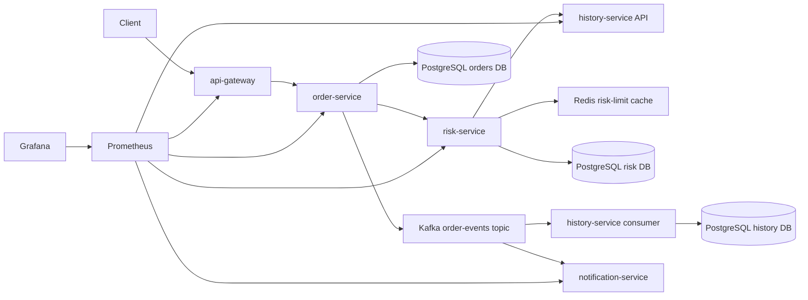

## Low-Level Design

### Request Flow

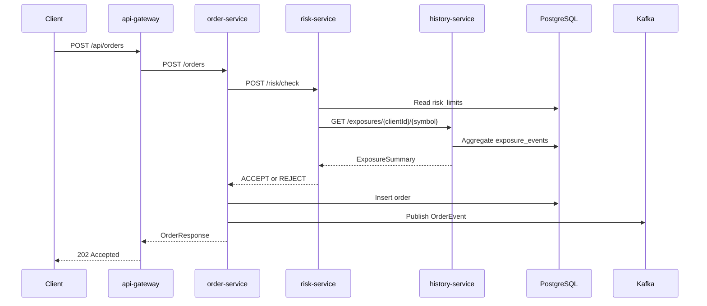

### Kafka Flow

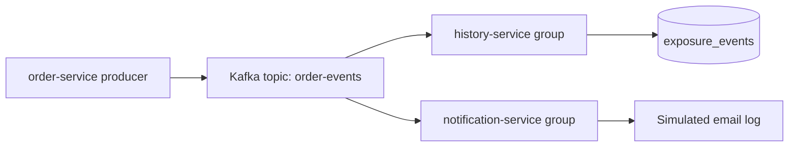

### Redis Flow

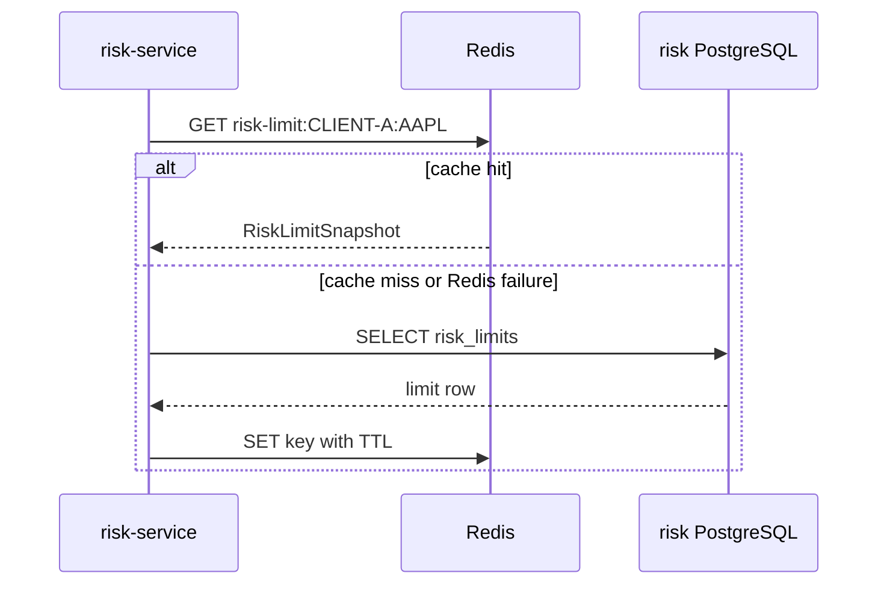

### Database Flow

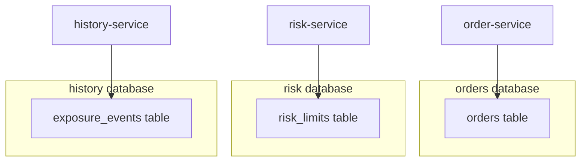

### Docker Architecture

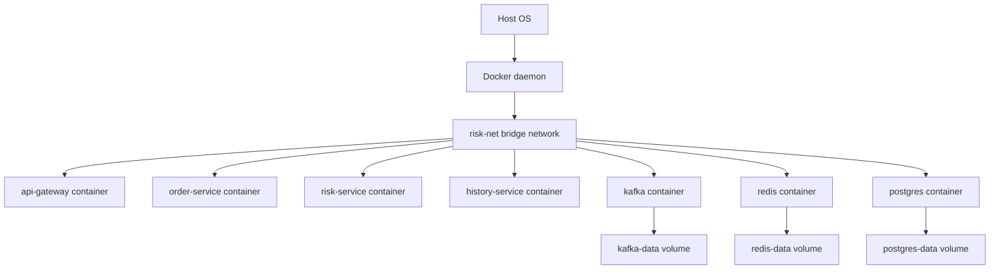

### Deployment Flow

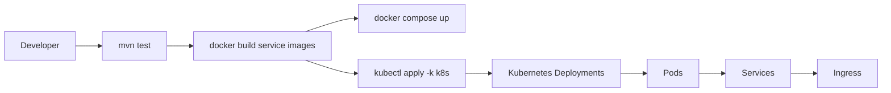

### Kubernetes Architecture

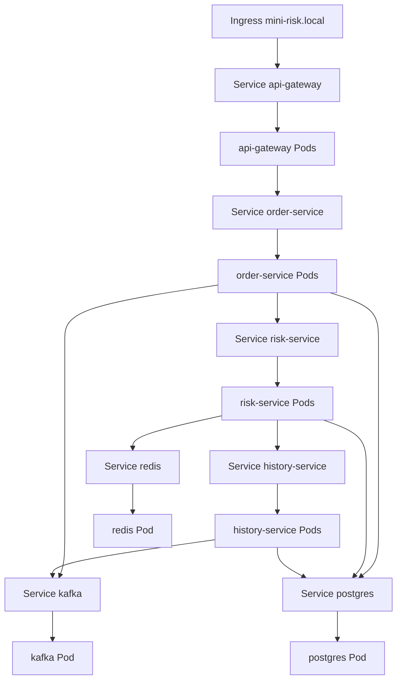

### Networking

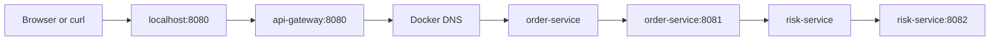

### Kubernetes Service Discovery

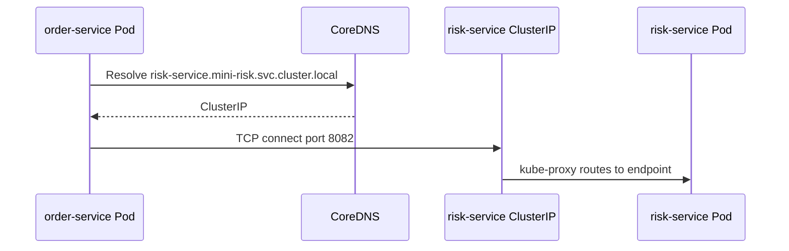

### Ingress Flow

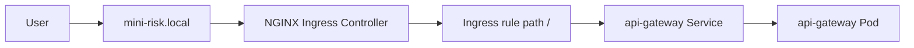

### Storage

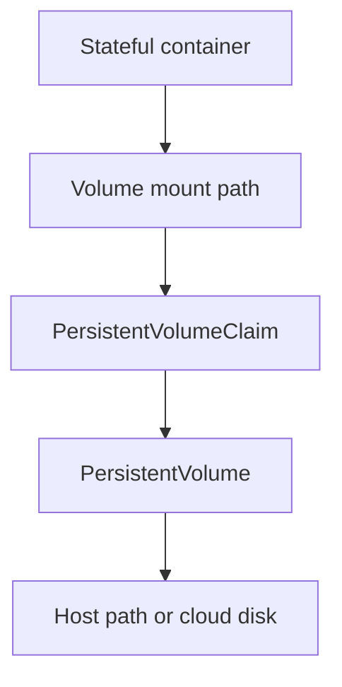

### Volume Mounts

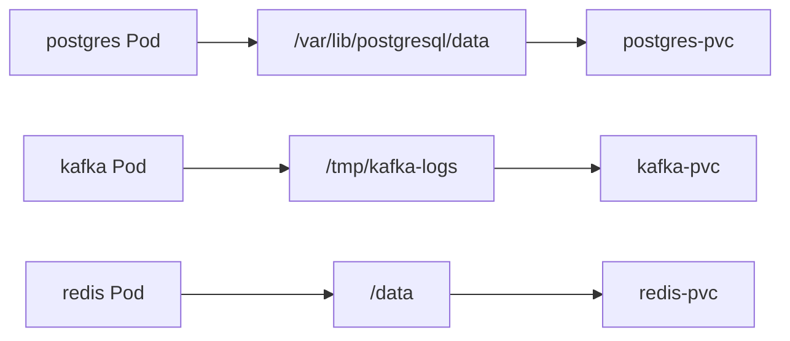

### Pod Lifecycle

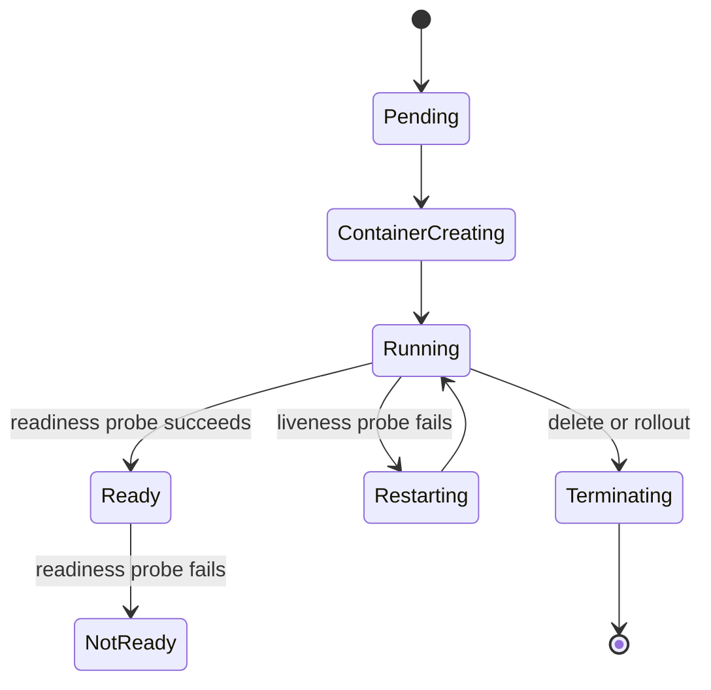

### Container Lifecycle

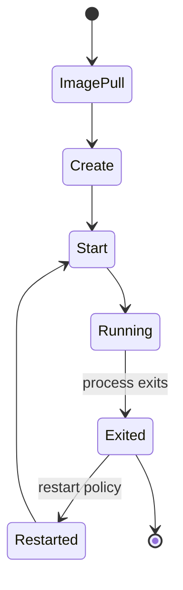

### CI/CD

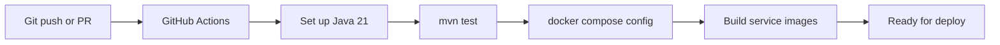

### Service Discovery

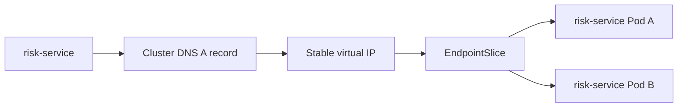
