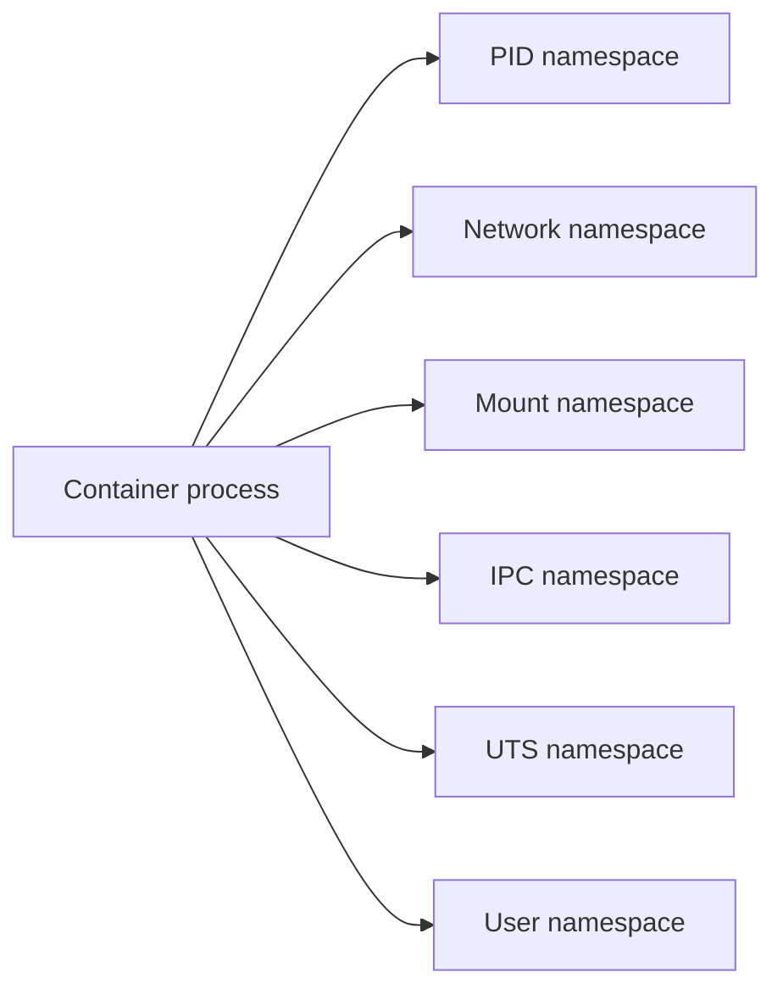
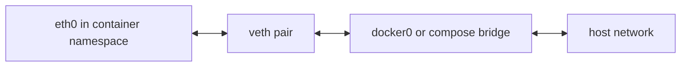
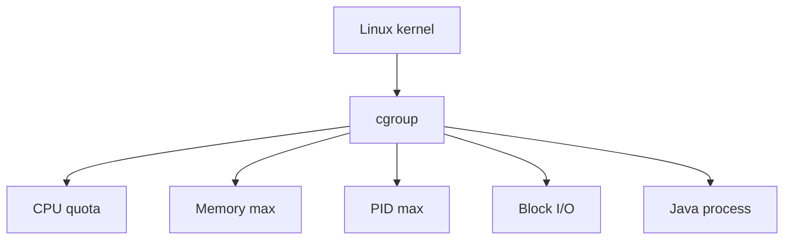
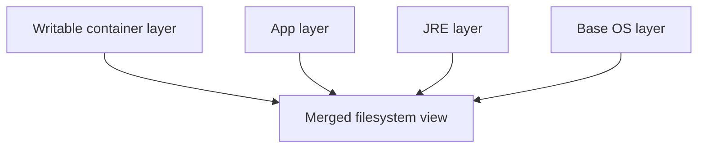
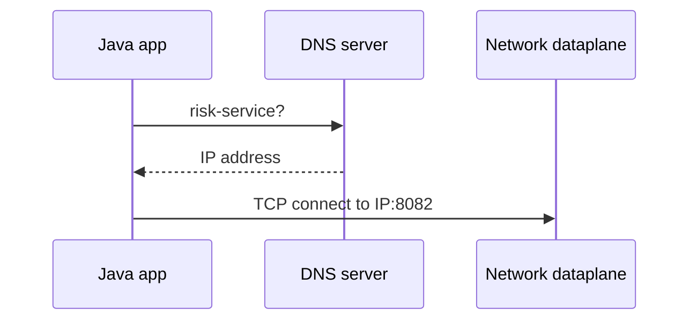
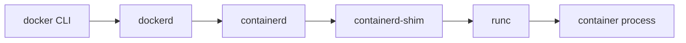

# Linux Internals For Containers

This guide explains the Linux mechanisms behind Docker and Kubernetes from first principles.

## Linux Process

A process is a running program plus kernel-managed state:

- PID
- virtual memory mappings
- open file descriptors
- signal handlers
- credentials
- current working directory
- namespaces
- cgroup membership
- threads

Mental model: a process is not "just code running." It is code plus a private view of memory and kernel resources.

## System Calls

User code cannot directly read disks, open sockets, or allocate kernel objects. It asks the kernel through system calls.

Examples:

| Syscall | Purpose |
| --- | --- |
| `clone` | Create a process or thread, optionally in new namespaces. |
| `execve` | Replace current process image with a new program. |
| `openat` | Open a file. |
| `read` and `write` | Read or write file descriptors. |
| `socket`, `bind`, `listen`, `accept` | Network server lifecycle. |
| `mount` | Attach filesystems. |
| `setns` | Join an existing namespace. |

Docker and Kubernetes are mostly orchestration around these primitives.

## Namespaces

Namespaces give a process a scoped view of a global resource.



## PID Namespace

Problem before PID namespaces: every process saw the host PID tree.

Solution: a container can see its own PID tree where the app process may be PID 1.

Production relevance:

- PID 1 handles signals differently.
- Bad signal handling causes slow shutdown.
- Zombie processes need reaping.

Debug:

```powershell
docker compose exec order-service ps
kubectl -n mini-risk exec deployment/order-service -- ps
```

## Network Namespace

A network namespace gives a process its own interfaces, routing table, ports, and firewall rules.

Docker creates a virtual ethernet pair:



Production relevance:

- Two containers can both bind port 8080 internally.
- Host port publishing maps host traffic into one container.
- DNS names resolve to container or Service IPs.

## Mount Namespace

Mount namespaces let a container see a different filesystem tree from the host.

The container root filesystem is usually image layers plus a writable layer.

Production relevance:

- Files written inside a container disappear when the container is deleted unless mounted to a volume.
- ConfigMaps and Secrets are mounted into Pods using the kubelet.

## User Namespace

User namespaces map container user IDs to host user IDs.

Production relevance:

- Running as root inside a container can be risky.
- User namespaces reduce damage if a process escapes.
- This project runs app containers as non-root.

## IPC Namespace

IPC namespaces isolate shared memory, semaphores, and message queues.

Production relevance:

- Processes in different containers do not share IPC resources by default.
- Some high-performance systems intentionally share IPC, but that weakens isolation.

## UTS Namespace

UTS namespaces isolate hostname and domain name.

Production relevance:

- A container can have a hostname separate from the host.
- Kubernetes usually sets Pod hostname based on Pod metadata.

## cgroups

cgroups limit and account resource usage:

- CPU shares and quotas
- memory limits
- process counts
- block I/O



Production relevance:

- Memory limit breach becomes OOMKilled in Kubernetes.
- CPU limit causes throttling, not killing.
- JVM heap must leave room for metaspace, threads, direct buffers, and native memory.

## OverlayFS And Union Filesystems

Images are built from immutable layers. A running container adds a writable upper layer.



Why invented: copying a full filesystem for every container would be slow and wasteful.

Tradeoff: writes inside containers can be slower and ephemeral. Use volumes for durable data.

## Bridge Network

Docker Compose creates a Linux bridge network. Containers attach to the bridge through virtual ethernet devices. The host forwards packets between containers and to the outside.

Common failure:

- Container is on the wrong network.
- Service name is wrong.
- Port exposed internally but not published to host.

## iptables And nftables

Linux packet filtering and NAT are implemented using iptables or nftables depending on distribution.

Docker and Kubernetes use these mechanisms to:

- publish host ports
- route Service IP traffic
- load balance to Pod endpoints
- apply network policy in some CNIs

Interview point: a Kubernetes Service is not a process. It is an API object that results in routing rules or userspace/eBPF dataplane behavior.

## DNS

Docker Compose provides DNS names for service names. Kubernetes uses CoreDNS.



Common failures:

- DNS server unreachable.
- Wrong namespace.
- Service has no endpoints.
- Search path confusion.

## Container Runtime

Docker is not the low-level runtime. Modern container startup usually involves:



Kubernetes usually talks to containerd through CRI:


## runc

`runc` creates the container according to the OCI runtime spec:

- set namespaces
- set cgroups
- set mounts
- set capabilities
- set user
- execute the process

## containerd

`containerd` manages image pulls, snapshots, container lifecycle, and runtime shims. Kubernetes prefers this narrower runtime layer over the full Docker daemon.

## How Docker Is Actually Implemented

When you run `docker run`:

1. CLI sends request to Docker daemon.
2. Daemon pulls or finds image layers.
3. Snapshotter prepares merged filesystem.
4. Daemon creates network namespace and bridge attachment.
5. Daemon configures mounts and volumes.
6. Daemon applies cgroup limits.
7. Daemon asks containerd to create a container.
8. containerd uses `runc` to call Linux primitives.
9. The target process starts.
10. Logs stream through stdout/stderr.

## Debugging From First Principles

Ask these questions:

1. Is the process running?
2. Is the process healthy?
3. Can it resolve the dependency name?
4. Can it connect to the dependency port?
5. Is the request reaching the application?
6. Is the application blocked on CPU, memory, disk, lock, or network?
7. Is state stored on an ephemeral layer or a persistent volume?
8. Are Kubernetes controllers making the state better or repeatedly restarting it?

