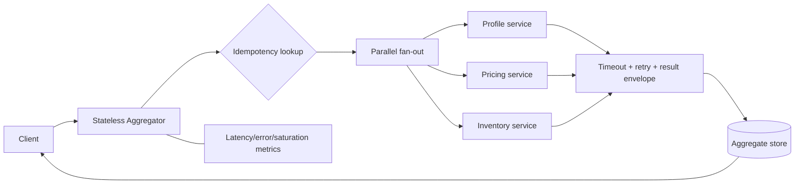

# Multi-Service Aggregator (HLD 30)

A runnable Java 17 fan-out/fan-in service that calls exactly three downstreams concurrently, applies per-call deadlines and bounded retries, returns useful partial results, and idempotently persists the final aggregate.

## Choose a Track

| Goal                                      | Start here                                                                              |
| ----------------------------------------- | --------------------------------------------------------------------------------------- |
| Prepare the 40–60 minute interview answer | [INTERVIEW_GUIDE.md](INTERVIEW_GUIDE.md)                                                |
| Inspect architecture and failure behavior | [docs/ARCHITECTURE.md](docs/ARCHITECTURE.md) and [FAILURE_DRILLS.md](FAILURE_DRILLS.md) |
| Evaluate real deployment gaps             | [PRODUCTION_READINESS.md](PRODUCTION_READINESS.md)                                      |

The codebase is shared; the evidence and completion criteria are separate.

## Run

```powershell
cd G:\TechStudyNotes\SystemDesignProjects\multi-service-aggregator
mvn test
mvn exec:java
```

The default demo persists JSON Lines to `data\aggregates.jsonl`. To run the HTTP endpoint:

```powershell
mvn exec:java "-Dexec.args=server"
Invoke-WebRequest "http://localhost:8080/aggregate?requestId=demo-2"
```

Complete responses return HTTP 200; partial responses return HTTP 206.

## Architecture



## What Is Implemented

- Three calls begin concurrently on a bounded executor.
- Per-call deadline and bounded retry attempts.
- Typed `OK`, `TIMEOUT`, and `ERROR` results rather than one ambiguous failure.
- Complete or partial aggregate with HTTP 200/206 semantics.
- Idempotency by `requestId` and save-if-absent persistence.
- In-memory test repository and runnable JSON Lines repository.
- Three tests proving concurrency, retry/idempotency, and timeout/partial failure.

The JSON Lines store keeps the demo dependency-free; a production deployment maps this boundary to PostgreSQL/DynamoDB and a unique `request_id`. Production also needs interruptible HTTP clients, circuit breakers, bulkhead metrics, authentication, and distributed tracing.

Use [INTERVIEW_GUIDE.md](INTERVIEW_GUIDE.md) for the timed answer, [docs/ARCHITECTURE.md](docs/ARCHITECTURE.md) for component/sequence diagrams, and [FAILURE_DRILLS.md](FAILURE_DRILLS.md) for incident prompts.
