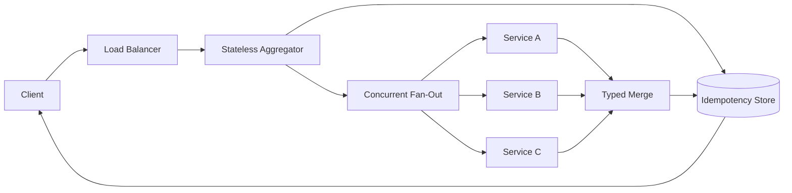
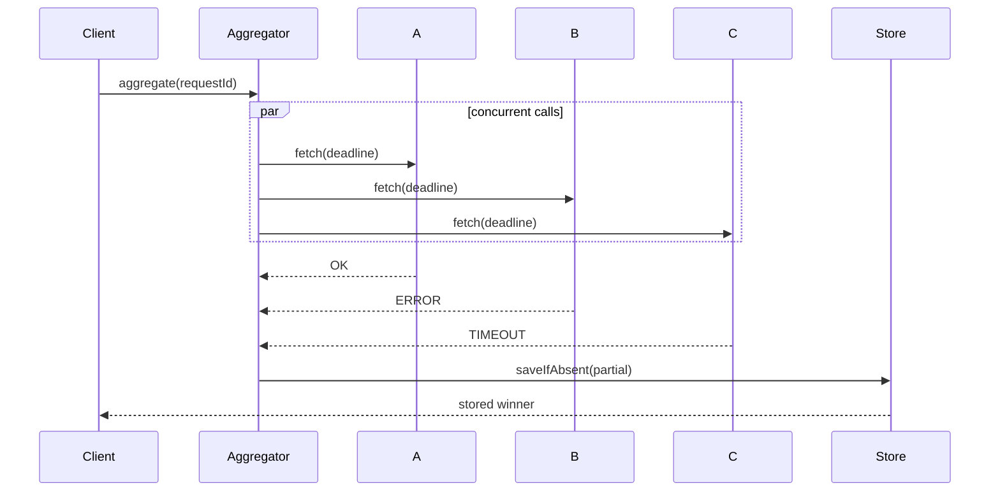

# Architecture

## High-Level Design

Aggregator instances are stateless. A distributed unique request ID coordinates retries and races; each downstream has an independent connection pool, bulkhead, deadline, and breaker.

## Low-Level Design

`CompletableFuture` supplies fan-out concurrency, every call returns a typed `CallOutcome`, and `AggregateRepository.saveIfAbsent` is the seam for a database unique constraint.
