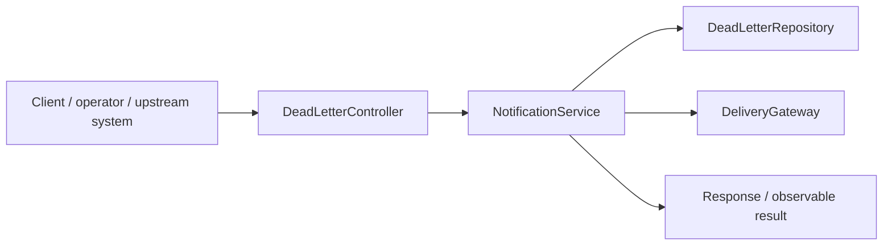
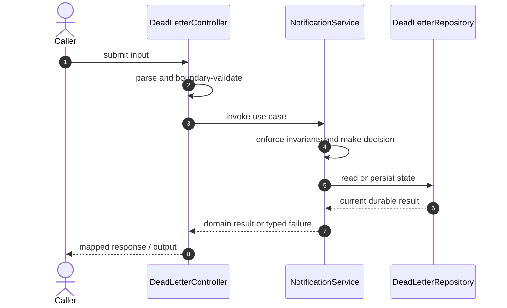

# Notification Platform Code Flow

This is the single code-flow guide for the project. It connects the business request to concrete source files, explains both architectural levels, and shows where validation, state changes, asynchronous work, and responses occur.

## Scope and outcome

A Spring Boot notification platform with email, SMS, and push channels; scheduled delivery; retry backoff; and dead-letter queue records.

The tracked production-code inventory used by this guide contains **23 source units** and **4 annotation-discovered HTTP operations**. Generated/build output and test sources are intentionally excluded from the runtime path.

## High-Level Design

At the system level, callers enter through an inbound adapter. The adapter owns transport concerns; application/domain code owns use-case decisions; repositories and gateways isolate state and external systems. Asynchronous adapters extend the flow without moving business invariants into controllers or consumers.

### Runtime stages

1. **Enter:** a request, command, scheduled trigger, protocol message, or UI action reaches the inbound boundary.
2. **Validate:** transport shape and required fields are rejected before domain mutation.
3. **Decide:** application/domain logic loads required state and applies invariants, idempotency, authorization, limits, or algorithms.
4. **Commit:** durable state changes pass through a repository/store; external calls pass through gateways; asynchronous work passes through message boundaries.
5. **Return and observe:** the adapter maps the result to an HTTP response, protocol response, CLI output, event, or metric.

## Low-Level Design

The low-level path keeps orchestration directional: inbound adapter → application/domain unit → persistence/outbound adapter. Contracts carry data between layers; configuration and security apply cross-cutting policy without becoming business logic.

### Component map

| Responsibility           | Concrete code                                                                                                                                        |
| ------------------------ | ---------------------------------------------------------------------------------------------------------------------------------------------------- |
| Entry point              | `NotificationPlatformApplication`                                                                                                                    |
| Supporting logic         | `DeliveryException`, `DeliveryRouter`, `SimulatedDelivery`, `ApiError`, `NotificationChannel`, `NotificationNotFoundException`, `NotificationStatus` |
| Outbound adapter         | `DeliveryGateway`, `EmailDeliveryGateway`, `PushDeliveryGateway`, `SmsDeliveryGateway`                                                               |
| Inbound adapter          | `DeadLetterController`, `GlobalExceptionHandler`, `NotificationController`                                                                           |
| Domain/data model        | `DeadLetterRecord`, `NotificationRecord`                                                                                                             |
| Persistence adapter      | `DeadLetterRepository`, `NotificationRepository`                                                                                                     |
| API/message contract     | `DeadLetterResponse`, `CreateNotificationRequest`, `NotificationResponse`                                                                            |
| Application/domain logic | `NotificationService`                                                                                                                                |

### Inbound operations

| Verb/trigger | Path or input                | Owning code              |
| ------------ | ---------------------------- | ------------------------ |
| `GET`        | `(class-level/default path)` | `DeadLetterController`   |
| `POST`       | `(class-level/default path)` | `NotificationController` |
| `GET`        | `/{id}`                      | `NotificationController` |
| `POST`       | `/{id}/retry`                | `NotificationController` |

## Detailed source walkthrough

Read this table top-down by category, then follow the linked files. “Key methods” are discovered from the checked-in implementation and identify useful debugging/interview entry points.

| Source file                                                                                                                               | Role                     | Responsibility and important methods                                                                                                                                                                 |
| ----------------------------------------------------------------------------------------------------------------------------------------- | ------------------------ | ---------------------------------------------------------------------------------------------------------------------------------------------------------------------------------------------------- |
| [`NotificationPlatformApplication.java`](./src/main/java/com/example/capstone/notification/NotificationPlatformApplication.java)          | Entry point              | NotificationPlatformApplication bootstraps the process and wires the runtime. Key methods: `main()`.                                                                                                 |
| [`DeliveryException.java`](./src/main/java/com/example/capstone/notification/delivery/DeliveryException.java)                             | Supporting logic         | DeliveryException provides a focused algorithm or shared implementation detail.                                                                                                                      |
| [`DeliveryGateway.java`](./src/main/java/com/example/capstone/notification/delivery/DeliveryGateway.java)                                 | Outbound adapter         | DeliveryGateway calls an external system through an isolated integration boundary.                                                                                                                   |
| [`DeliveryRouter.java`](./src/main/java/com/example/capstone/notification/delivery/DeliveryRouter.java)                                   | Supporting logic         | DeliveryRouter provides a focused algorithm or shared implementation detail. Key methods: `deliver()`.                                                                                               |
| [`EmailDeliveryGateway.java`](./src/main/java/com/example/capstone/notification/delivery/EmailDeliveryGateway.java)                       | Outbound adapter         | EmailDeliveryGateway calls an external system through an isolated integration boundary. Key methods: `channel()`, `deliver()`.                                                                       |
| [`PushDeliveryGateway.java`](./src/main/java/com/example/capstone/notification/delivery/PushDeliveryGateway.java)                         | Outbound adapter         | PushDeliveryGateway calls an external system through an isolated integration boundary. Key methods: `channel()`, `deliver()`.                                                                        |
| [`SimulatedDelivery.java`](./src/main/java/com/example/capstone/notification/delivery/SimulatedDelivery.java)                             | Supporting logic         | SimulatedDelivery provides a focused algorithm or shared implementation detail.                                                                                                                      |
| [`SmsDeliveryGateway.java`](./src/main/java/com/example/capstone/notification/delivery/SmsDeliveryGateway.java)                           | Outbound adapter         | SmsDeliveryGateway calls an external system through an isolated integration boundary. Key methods: `channel()`, `deliver()`.                                                                         |
| [`DeadLetterController.java`](./src/main/java/com/example/capstone/notification/dlq/DeadLetterController.java)                            | Inbound adapter          | DeadLetterController accepts an inbound call, validates its boundary contract, and delegates work. Key methods: `list()`.                                                                            |
| [`DeadLetterRecord.java`](./src/main/java/com/example/capstone/notification/dlq/DeadLetterRecord.java)                                    | Domain/data model        | DeadLetterRecord represents domain state, identity, or an invariant-bearing value. Key methods: `getId()`, `getNotificationId()`, `getChannel()`, `getRecipient()`, `getReason()`, `getCreatedAt()`. |
| [`DeadLetterRepository.java`](./src/main/java/com/example/capstone/notification/dlq/DeadLetterRepository.java)                            | Persistence adapter      | DeadLetterRepository reads or writes durable state behind a storage boundary.                                                                                                                        |
| [`DeadLetterResponse.java`](./src/main/java/com/example/capstone/notification/dlq/DeadLetterResponse.java)                                | API/message contract     | DeadLetterResponse carries validated data across an API or messaging boundary. Key methods: `from()`.                                                                                                |
| [`ApiError.java`](./src/main/java/com/example/capstone/notification/error/ApiError.java)                                                  | Supporting logic         | ApiError provides a focused algorithm or shared implementation detail. Key methods: `of()`.                                                                                                          |
| [`GlobalExceptionHandler.java`](./src/main/java/com/example/capstone/notification/error/GlobalExceptionHandler.java)                      | Inbound adapter          | GlobalExceptionHandler accepts an inbound call, validates its boundary contract, and delegates work. Key methods: `handleNotFound()`, `handleValidation()`.                                          |
| [`CreateNotificationRequest.java`](./src/main/java/com/example/capstone/notification/notification/CreateNotificationRequest.java)         | API/message contract     | CreateNotificationRequest carries validated data across an API or messaging boundary.                                                                                                                |
| [`NotificationChannel.java`](./src/main/java/com/example/capstone/notification/notification/NotificationChannel.java)                     | Supporting logic         | NotificationChannel provides a focused algorithm or shared implementation detail.                                                                                                                    |
| [`NotificationController.java`](./src/main/java/com/example/capstone/notification/notification/NotificationController.java)               | Inbound adapter          | NotificationController accepts an inbound call, validates its boundary contract, and delegates work. Key methods: `create()`, `get()`, `retry()`.                                                    |
| [`NotificationNotFoundException.java`](./src/main/java/com/example/capstone/notification/notification/NotificationNotFoundException.java) | Supporting logic         | NotificationNotFoundException provides a focused algorithm or shared implementation detail.                                                                                                          |
| [`NotificationRecord.java`](./src/main/java/com/example/capstone/notification/notification/NotificationRecord.java)                       | Domain/data model        | NotificationRecord represents domain state, identity, or an invariant-bearing value. Key methods: `markSent()`, `markFailure()`, `requeueManually()`, `getId()`, `getChannel()`, `getRecipient()`.   |
| [`NotificationRepository.java`](./src/main/java/com/example/capstone/notification/notification/NotificationRepository.java)               | Persistence adapter      | NotificationRepository reads or writes durable state behind a storage boundary.                                                                                                                      |
| [`NotificationResponse.java`](./src/main/java/com/example/capstone/notification/notification/NotificationResponse.java)                   | API/message contract     | NotificationResponse carries validated data across an API or messaging boundary. Key methods: `from()`.                                                                                              |
| [`NotificationService.java`](./src/main/java/com/example/capstone/notification/notification/NotificationService.java)                     | Application/domain logic | NotificationService coordinates the use case and enforces domain decisions. Key methods: `create()`, `get()`, `manualRetry()`, `processDueNotifications()`, `attemptDelivery()`.                     |
| [`NotificationStatus.java`](./src/main/java/com/example/capstone/notification/notification/NotificationStatus.java)                       | Supporting logic         | NotificationStatus provides a focused algorithm or shared implementation detail.                                                                                                                     |

## End-to-end code-flow narrative

1. Start at `DeadLetterController`. It receives the external input and should perform only boundary parsing, authentication/authorization handoff, and request validation.
2. Follow the call into `NotificationService`. This is the principal place to explain the use case, invariant checks, deduplication/concurrency decision, and success/failure result.
3. Continue into `DeadLetterRepository` for the durable or in-memory state transition. Transaction and consistency guarantees belong at this boundary, not in response mapping.
4. This flow completes synchronously; background work is not part of the primary checked-in path.
5. Inspect `DeliveryGateway` for timeout, retry, circuit-breaking, and external-contract mapping.
6. Return to `DeadLetterController`, where typed outcomes become the public response or protocol result. Logging and metrics should preserve correlation identifiers without leaking secrets.

## Failure and correctness checkpoints

- **Invalid input:** rejected at the inbound contract before state mutation.
- **Domain conflict:** returned as a typed result; do not hide it as an infrastructure exception.
- **Duplicate or concurrent work:** handled where the project’s idempotency, locking, ordering, or atomic data structure is implemented.
- **Storage/integration failure:** transaction is rolled back or the operation remains safely retryable.
- **Async failure:** consumer retries must preserve idempotency; poison work must become observable rather than loop silently.
- **Observability:** trace the same request/correlation identity through inbound, domain, persistence, and async logs.

## How to trace a scenario in the debugger

1. Choose one operation from the inbound-operations table or the project’s demo script.
2. Break at `DeadLetterController`, then step into `NotificationService` rather than framework internals.
3. Inspect the command/request object immediately after validation.
4. Stop before and after the call to `DeadLetterRepository` to compare intended and durable state.
5. If messaging exists, capture the emitted identifier and continue from `the consumer/worker`.
6. Confirm the final public result and the corresponding logs/metrics.

## Related project documentation

- [Project README](./README.md)
- [Specialized diagrams](./docs/DIAGRAMS.md)
- [Interview guide](./docs/INTERVIEW_GUIDE.md)
