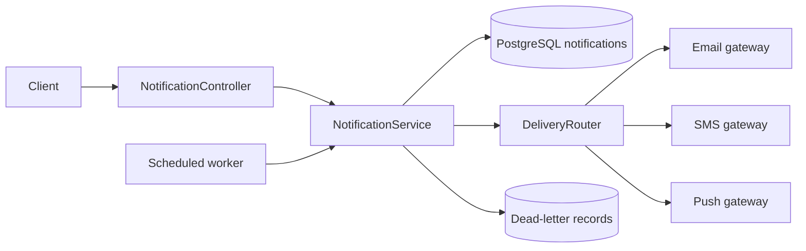
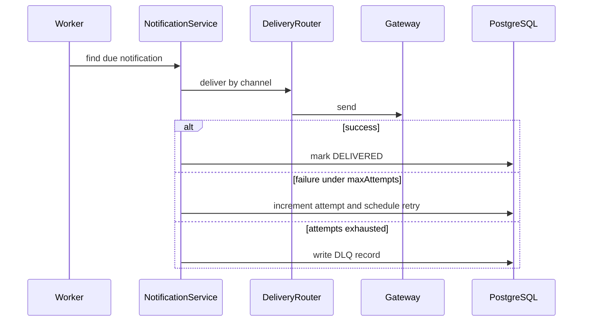
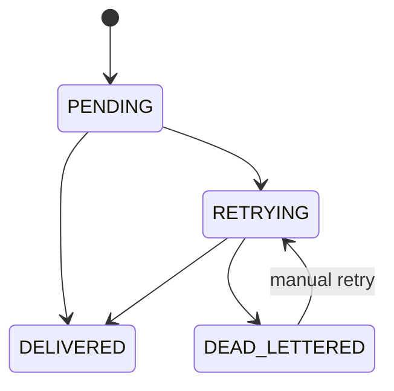

# Notification Platform Diagrams

## High-Level Design

### Component View

```mermaid
flowchart LR
    Client["Client"] --> API["NotificationController"]
    API --> Service["NotificationService"]
    Service --> DB[("PostgreSQL notifications")]
    Worker["Scheduled worker"] --> Service
    Service --> Router["DeliveryRouter"]
    Router --> Email["Email gateway"]
    Router --> SMS["SMS gateway"]
    Router --> Push["Push gateway"]
    Service --> DLQ[("Dead-letter records")]
```

## Low-Level Design

### Retry Flow

```mermaid
sequenceDiagram
    participant W as Worker
    participant S as NotificationService
    participant R as DeliveryRouter
    participant D as Gateway
    participant DB as PostgreSQL
    W->>S: find due notification
    S->>R: deliver by channel
    R->>D: send
    alt success
        S->>DB: mark DELIVERED
    else failure under maxAttempts
        S->>DB: increment attempt and schedule retry
    else attempts exhausted
        S->>DB: write DLQ record
    end
```

### State Flow

```mermaid
stateDiagram-v2
    [*] --> PENDING
    PENDING --> DELIVERED
    PENDING --> RETRYING
    RETRYING --> DELIVERED
    RETRYING --> DEAD_LETTERED
    DEAD_LETTERED --> RETRYING: manual retry
```
