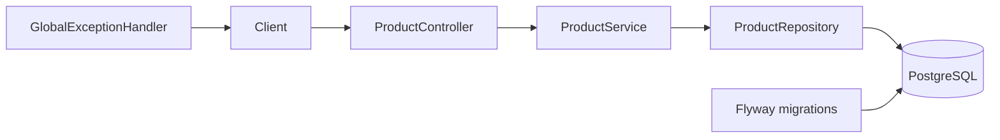
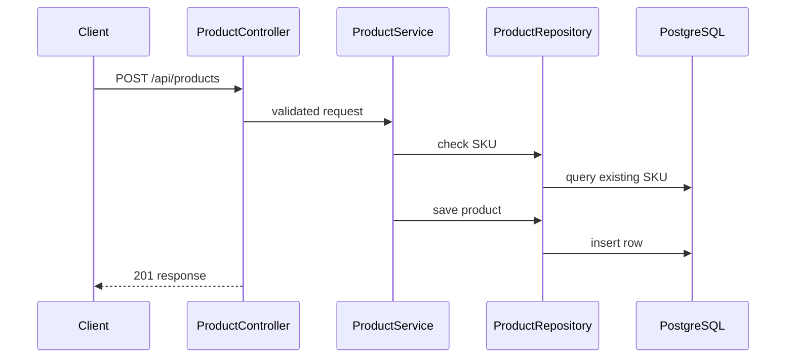
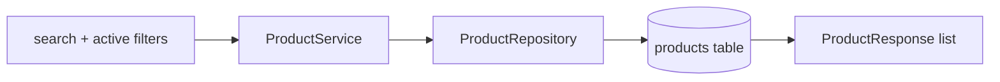

# Product Catalog API Diagrams

## High-Level Design

### Component View

```mermaid
flowchart LR
    Client["Client"] --> Controller["ProductController"]
    Controller --> Service["ProductService"]
    Service --> Repository["ProductRepository"]
    Repository --> DB[("PostgreSQL")]
    Flyway["Flyway migrations"] --> DB
    Errors["GlobalExceptionHandler"] --> Client
```

## Low-Level Design

### Create Product Flow

```mermaid
sequenceDiagram
    participant C as Client
    participant API as ProductController
    participant S as ProductService
    participant R as ProductRepository
    participant DB as PostgreSQL
    C->>API: POST /api/products
    API->>S: validated request
    S->>R: check SKU
    R->>DB: query existing SKU
    S->>R: save product
    R->>DB: insert row
    API-->>C: 201 response
```

### Read/Search Flow

```mermaid
flowchart LR
    Query["search + active filters"] --> Service["ProductService"]
    Service --> Repo["ProductRepository"]
    Repo --> DB[("products table")]
    DB --> Response["ProductResponse list"]
```
