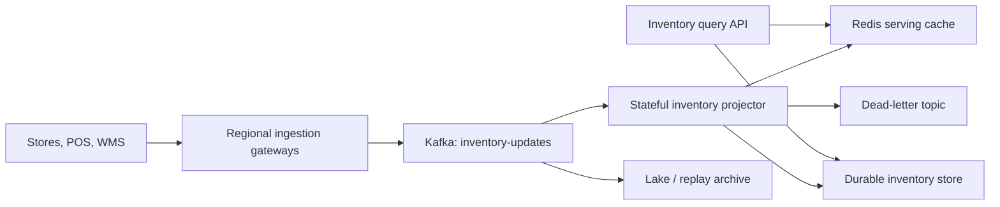
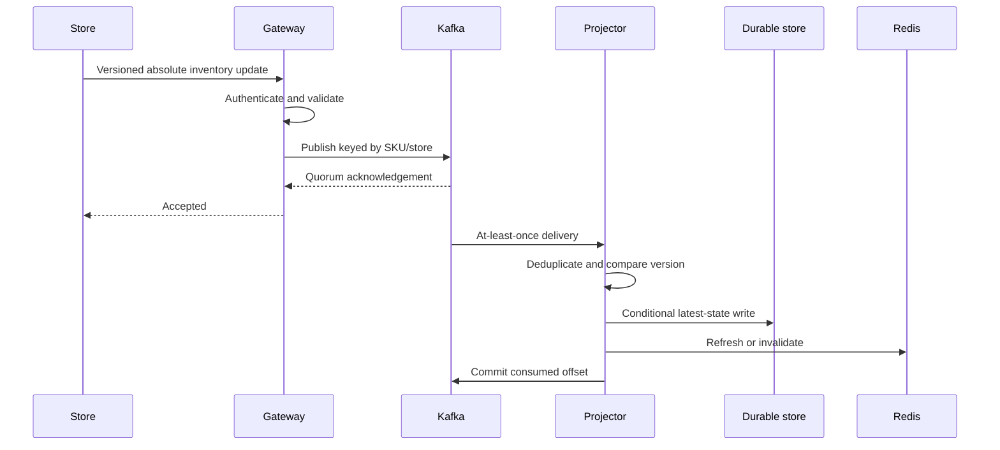
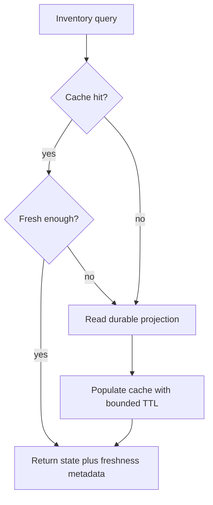
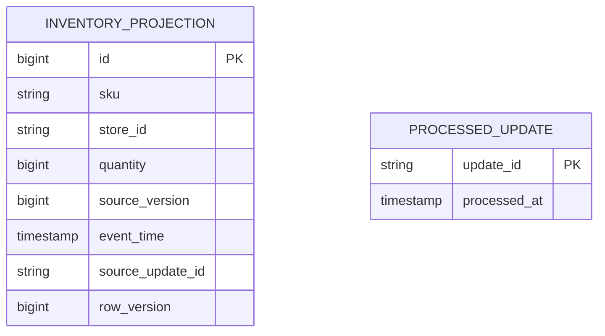

# Architecture

## Requirements and invariants

Functional requirements:

- accept inventory state from thousands of intermittently connected stores;
- expose the latest store-level quantity and a cross-store SKU summary;
- tolerate retries, duplicates, delayed events, and out-of-order arrival;
- identify exact and configurable time-window duplicate transactions;
- retain enough evidence to explain why an update won or was rejected.

Non-functional targets are sub-100 ms in-region query p99, normal-state visibility within two seconds, horizontal ingestion scaling, multi-AZ availability, and replayable recovery. Inventory visibility is not checkout reservation: reservation needs a separate atomic available-to-promise workflow.

The central invariant is: for every `(sku, storeId)`, the materialized value is the maximum observed update under `(version, eventTime, updateId)` ordering.

## Production topology

### Component reasoning

| Component | Responsibility | Why it exists |
|---|---|---|
| Regional gateway | authentication, schema validation, throttling, durable publish | isolates unreliable store networks from the core platform |
| Kafka | replicated event log and per-key ordering | decouples bursty producers from projection throughput and enables replay |
| Projector | idempotency, version comparison, materialized views | converts an event history into query-efficient state |
| Redis | low-latency hot reads | shields the durable store from browse traffic |
| Durable store | authoritative serving state and fallback reads | survives cache loss and supports reconciliation |
| Lake/archive | long retention and offline rebuild input | broker retention should not be the only recovery strategy |

## Write path

1. A store submits an absolute inventory state with a stable `updateId`, per-key source `version`, and event time.
2. A gateway authenticates the source, validates schema, durably publishes, and acknowledges only after broker quorum.
3. Kafka partitions by `(sku, storeId)`. This preserves per-key order while allowing horizontal scaling.
4. The projector ignores processed IDs and events older than the materialized version.
5. The projector writes its local state/changelog and updates the serving store. Consumers are at-least-once; idempotency provides effectively-once state.
6. Query APIs read the cache and fall back to the durable store.

The offset is committed after state persistence. A crash between the write and offset commit causes replay, which is safe because update IDs and versions make processing idempotent.

## Read models

- `inventory_by_sku_store`: authoritative latest state for precise availability.
- `stores_by_sku`: search-friendly projection for nearby-store results.
- `sku_region_summary`: asynchronously maintained aggregate for low-latency regional/global reads.

Aggregates are eventually consistent. Store-level reads can expose `eventTime` and `version` so callers know freshness.

Cache-aside avoids coupling write availability to Redis. Invalidation or short TTLs constrain staleness; clients always receive the source event time so they can apply stricter policies.

## Data model

`(sku, store_id)` is unique. The row version protects local concurrent persistence. The processed-update record handles direct replay; the source version remains the durable stale-event defense when processed IDs are eventually expired.

## Availability and failure handling

- Multi-AZ replicated Kafka and databases; stateless APIs span zones.
- Store clients use an outbox and retry when disconnected.
- Consumer checkpoints plus broker retention enable replay and projection rebuilds.
- Poison events go to a DLQ after bounded retries.
- Backpressure is visible through consumer lag; autoscaling follows lag and processing latency.
- Region isolation favors local writes and reads. Cross-region summaries replicate asynchronously.

## Failure reasoning

| Failure | Observable behavior | Recovery |
|---|---|---|
| Store offline | last known state becomes stale | local outbox retries; UI exposes last-update time |
| Duplicate delivery | same update reaches projector again | processed ID rejects it; state remains unchanged |
| Late event | older version arrives after newer state | version comparison rejects it |
| Projector crash | partition processing pauses and lag rises | replacement restores checkpoint and replays log |
| Cache outage | latency rises but reads continue | query API falls back to durable store |
| Poison event | one malformed record repeatedly fails | bounded retry, DLQ, alert, and manual replay after repair |
| Region loss | local freshness degrades | route reads to replica; queued writes replay after recovery |

## Consistency model

- Per SKU/store: deterministic last-version-wins convergence.
- Processed update: atomic with the local projection in the runnable slice.
- Cross-store summary: eventual because synchronous global aggregation would increase latency and reduce availability.
- Cache: bounded-stale, with durable fallback.
- Multi-region: local-write ownership is preferred; active-active writes to the same key require an explicit conflict policy.

This is an AP-leaning visibility system during network partitions. A reservation or decrement system would make different consistency choices because overselling has financial impact.

## Security and operations

- Authenticate store devices with short-lived credentials and rotate them.
- Authorize each device only for its store identity; never trust `storeId` from an unbound payload.
- Encrypt traffic and storage, redact customer-linked transaction fields, and retain audit decisions.
- Apply schema compatibility checks before deployment.
- Track consumer lag age, projection latency, stale-store percentage, DLQ rate, conflict count, and cache hit ratio.
- Use trace IDs carrying `updateId` across gateway, broker headers, projector, and serving logs.

## Local-to-production mapping

| Local implementation | Production counterpart |
|---|---|
| REST update endpoint | gateway plus Kafka producer |
| transactional JPA service | partitioned stream processor |
| H2/PostgreSQL projection | RocksDB plus Cassandra/DynamoDB/PostgreSQL |
| processed-update table | compacted idempotency state with retention |
| Actuator counters | Prometheus dashboards and alerts |

The repository intentionally simulates infrastructure boundaries rather than pretending one local process is a globally distributed deployment.

## Alternatives considered

| Alternative | Useful when | Why it is not the default here |
|---|---|---|
| Poll every store database | small estate and relaxed freshness | poor freshness and costly fan-out at thousands of stores |
| Direct synchronous central writes | simple low-volume environment | store latency and central outages directly block sales systems |
| Timestamp-only last-write-wins | one trusted clock domain | clock skew can overwrite newer inventory with older state |
| Database change-data-capture | stores already persist authoritative rows | still needs connectivity, schema governance, and source versioning |
| Exactly-once marketing claim | tightly controlled single platform | end-to-end side effects still require idempotency and reconciliation |
