# Interview Guide

## How to frame the problem

Start by separating three meanings that are often blurred:

1. **Inventory visibility:** what quantity did each store most recently report?
2. **Available to promise:** how many units can safely be reserved or sold?
3. **Inventory ledger:** which receipts, sales, returns, and adjustments produced the quantity?

This project solves the first problem. Explicitly excluding reservation keeps the consistency argument honest and gives you a natural extension if the interviewer asks about overselling.

## Two-minute opening

“I model inventory as an absolute, versioned state per SKU and store. Store gateways durably publish updates to Kafka, partitioned by that key. A stateful projector handles retries and out-of-order delivery through update IDs and monotonic source versions, then maintains store-level and aggregate read models. Query APIs serve low-latency availability from Redis with a durable fallback. The same repository demonstrates the core reducer and transaction deduplication algorithms with executable tests.”

Then state the core invariant: “For each SKU/store key, the visible state is the maximum event under source version ordering. Arrival time never decides correctness.”

## Whiteboard flow

```mermaid
flowchart LR
  Clarify["Clarify visibility vs reservation"] --> Estimate["Estimate stores, SKUs, update rate, freshness"]
  Estimate --> Contract["Define versioned absolute update contract"]
  Contract --> Pipeline["Gateway, Kafka, projector"]
  Pipeline --> Views["Store and aggregate read models"]
  Views --> Failures["Retries, offline stores, replay, region loss"]
  Failures --> Tradeoffs["Consistency and alternatives"]
```

This order demonstrates reasoning rather than listing technologies.

## Demo sequence

1. Run `mvn clean verify` to establish correctness.
2. Start with `mvn spring-boot:run`.
3. Submit version 2, then version 1; show `STALE_IGNORED` and quantity remaining at version 2.
4. replay version 2 with the same update ID; show `DUPLICATE_IGNORED`.
5. query the SKU summary.
6. submit three transactions and show only the matching pair grouped within five minutes.
7. open `/actuator/prometheus` and point to `inventory_updates_total`.

Expected evidence:

| Action | Expected result | What it proves |
|---|---|---|
| Submit version 2 | `APPLIED`, quantity 25 | normal projection |
| Submit version 1 afterward | `STALE_IGNORED`, quantity 25 | arrival order cannot corrupt state |
| Replay version 2 ID | `DUPLICATE_IGNORED` | retry-safe processing |
| Query summary | total 25, one store | serving projection works |
| Submit matching transactions | one group | business-key time-window detection |

## Trade-offs to say aloud

- Absolute states tolerate missing intermediate events; deltas preserve movements but demand strict sequencing and reconciliation.
- At-least-once delivery plus idempotent state is operationally simpler than distributed exactly-once claims.
- Store-level state is strongly convergent by source version; cross-store summaries are deliberately eventual.
- A processed-ID store needs retention. Source versions remain the long-term stale-event defense after IDs expire.
- Hash maps solve a bounded stream; partitioned state plus checkpoints solve the unbounded version.

### Decision table

| Question | Chosen design | Reasoning | What changes the choice |
|---|---|---|---|
| Absolute state or delta? | absolute state | self-heals after missed events | choose ledgered deltas if movement audit is primary |
| Partition key? | SKU plus store | preserves per-item order and distributes hot SKUs | a single-writer store stream may key by store with lower parallelism |
| Delivery guarantee? | at-least-once plus idempotency | robust across system boundaries | broker-local exactly-once may reduce duplicates but not external side effects |
| Source ordering? | monotonic version | independent of clock skew | centralized sequencer adds latency and availability dependency |
| Aggregate consistency? | eventual | fast regional reads and resilient writes | reservation totals may require stronger atomicity |
| Duplicate algorithm? | normalized fingerprint plus time window | explainable and scalable | fuzzy ML matching fits noisy merchants but needs precision/recall governance |

## Coding problem explanation

### Latest state per SKU

For each update, compute `(sku, storeId)` and merge it into a hash map. Keep the candidate only if its ordering tuple is greater than the current value.

- Expected time: `O(n)`.
- Memory: `O(k)` for `k` distinct SKU/store keys.
- Distributed version: hash-partition on the same key; each partition performs the same reducer.
- Unbounded version: checkpoint state and compact superseded versions.

Do not sort the entire stream unless downstream output must be globally ordered. Sorting raises the bounded algorithm from `O(n)` to `O(n log n)` without improving per-key correctness.

### Duplicate transactions

First define a duplicate. The implementation uses normalized account, merchant, amount-in-cents, and currency as the business fingerprint. Exact duplicates also require equal timestamps; near duplicates fall within a configured time window.

- In-memory exact groups: expected `O(n)` time and `O(u)` memory.
- Near duplicates: bucket, sort each bucket by timestamp, then scan; overall `O(n log n)` worst case.
- Larger than memory: hash-partition by fingerprint, externally sort each partition, and scan independently.
- Bloom filter: useful only as a negative pre-check; false positives mean it cannot be the authority.

Call out the cluster rule: adjacent matching events chain transitively. If A is near B and B is near C, all three group together even when A-to-C exceeds the window. That is a business decision, not an algorithmic inevitability.

## Likely follow-ups

**What if two writers issue the same version?** Treat that as a source contract violation, record a conflict metric, and use event time/update ID only for deterministic convergence. Fix ownership upstream.

**What if a store is offline?** Its outbox buffers updates. Reads return last-update time and may mark availability stale after a threshold.

**How do you avoid overselling?** Visibility is not reservation. Checkout requires a separate reservation/ATP workflow with atomic decrement, expiry, and compensation.

**How do you rebuild?** Create a new projection version, replay retained events or the lake archive, validate counts/freshness, then switch reads.

**How do duplicate clusters behave transitively?** The implementation chains adjacent events: A near B and B near C form one cluster even if A-to-C exceeds the window. State this business choice explicitly.

**Why not use arrival time?** Network delay, retries, and offline stores make arrival time unrelated to business order. Source version is the ordering authority.

**Can Kafka alone prevent duplicates?** It preserves order inside a partition and can provide transactional broker operations, but clients, retries, databases, and cache effects still make idempotency necessary.

**What is the hottest key?** `(sku, storeId)` distributes a popular SKU across stores. The regional aggregate for that SKU can be hot, so use two-stage aggregation: local partials followed by sharded regional combination.

**How long do processed IDs live?** At least the maximum realistic retry/replay horizon. After expiry, source version still prevents stale mutation. Long historical replays should target a new projection namespace.

## Strong closing

“The runnable code proves the correctness kernel, while the production design preserves the same contracts across Kafka and distributed storage. My most important choice is versioned absolute state: it lets the system converge after duplicates, reordering, disconnection, and replay without pretending that visibility is the same as reservation.”
