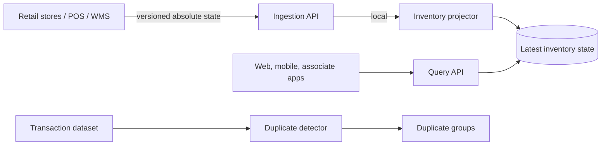
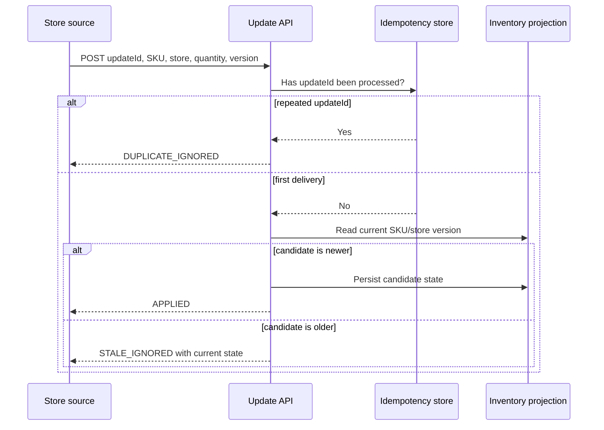
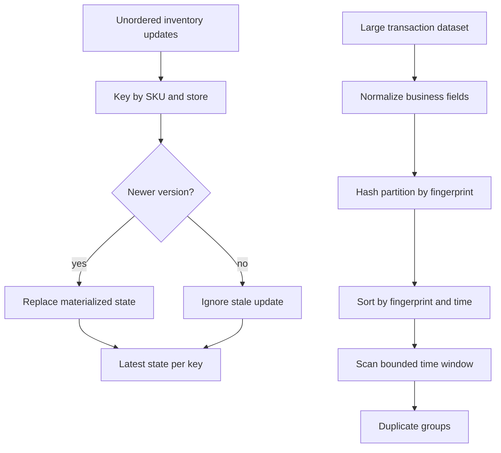

# Real-Time Retail Inventory Platform

A runnable, interview-ready Java backend that combines three related problems:

1. real-time inventory visibility across thousands of stores;
2. latest-state computation from an unordered inventory-update stream;
3. exact and time-window duplicate transaction detection.

The local vertical slice uses Spring Boot, JPA, H2/PostgreSQL, Actuator, Prometheus metrics, and deterministic algorithms. The production design evolves the same contracts to Kafka, partitioned stream processors, Redis, and a distributed durable store without changing the API semantics.

## What this project proves

- A higher source version wins even if inventory events arrive out of order.
- Replaying the same `updateId` does not alter state.
- Store-level state and cross-store summaries are queryable through HTTP.
- Exact and near-duplicate payments are grouped using normalized business fields.
- The core algorithms are separated from framework code and covered by tests.
- The local implementation is explicitly mapped to production-scale components.

It does **not** claim that one Spring Boot process is the production topology. Kafka, distributed state, Redis, and multi-region deployment are architecture boundaries documented in this repository rather than silently mocked.

## System at a glance



In production, the direct ingestion-to-projector call becomes a durable Kafka boundary. See [ARCHITECTURE.md](ARCHITECTURE.md) for the full topology and failure flows.

## Run it

Requirements: Java 17+ and Maven 3.9+.

```powershell
mvn clean verify
mvn spring-boot:run
```

Use `requests.http` from IntelliJ/VS Code, or in another terminal:

```powershell
./scripts/demo.ps1
```

The default H2 database is in memory. For PostgreSQL:

```powershell
mvn clean package
docker compose up --build
```

## Five-minute demo

1. Run `mvn clean verify` and show all unit and API integration tests passing.
2. Start the service with `mvn spring-boot:run`.
3. Execute `./scripts/demo.ps1` or the calls in `requests.http`.
4. Observe version 2 being applied, version 1 being ignored, and quantity remaining at 25.
5. Replay the version 2 update and observe `DUPLICATE_IGNORED`.
6. Call the transaction endpoint and observe one duplicate group.
7. Inspect `/actuator/prometheus` for result-labelled update counters.

## Core correctness rules

- The materialized key is `(sku, storeId)`, because availability is store-specific.
- Every source must provide a monotonically increasing `version` per key.
- Higher version wins even when events arrive out of order.
- Equal versions use `eventTime`, then `updateId`, for deterministic convergence.
- Repeated `updateId` values are idempotently ignored.
- Quantity is an absolute on-hand state, not a delta; delta events require ordered processing and different recovery semantics.
- Amounts use integer cents, never floating point.

The winning order is the tuple `(version, eventTime, updateId)`. Version is authoritative; the other fields only make equal-version conflicts converge deterministically. Equal versions from different writers should still trigger operational investigation because they violate the ownership contract.

## End-to-end update flow



## APIs

| Method | Endpoint | Purpose |
|---|---|---|
| POST | `/api/v1/inventory/updates` | Apply one idempotent update |
| POST | `/api/v1/inventory/updates/batch` | Apply a batch |
| GET | `/api/v1/inventory/{sku}/stores/{storeId}` | Store-level availability |
| GET | `/api/v1/inventory/{sku}` | All reporting stores |
| GET | `/api/v1/inventory/{sku}/summary` | Aggregate availability |
| POST | `/api/v1/transactions/duplicates?windowSeconds=300` | Exact or near duplicates |
| GET | `/actuator/health` | Health |
| GET | `/actuator/prometheus` | Metrics |

## Algorithm complexity

Latest SKU/store state uses a hash map and is expected `O(n)` time, `O(k)` memory for `k` distinct keys. In production, Kafka partitions by `hash(sku, storeId)` so all updates for a key reach one ordered consumer; local state is backed by RocksDB and changelogged for recovery.

Exact transaction deduplication is expected `O(n)` time and `O(u)` memory. Near-duplicate detection buckets by normalized business fingerprint, sorts by time, then scans: `O(n log n)` time. For data larger than memory, hash-partition by fingerprint first; equal fingerprints are guaranteed to meet in one bounded partition.



## Repository layout

| Path | Responsibility |
|---|---|
| `api/` | HTTP contracts, validation, and error responses |
| `service/` | version ordering, idempotency, and query orchestration |
| `persistence/` | latest-state and processed-update JPA models |
| `algorithms/` | framework-independent stream reducers and deduplication |
| `src/test/` | algorithm and end-to-end API verification |
| `requests.http` | repeatable manual API examples |
| `scripts/demo.ps1` | short interview demonstration |

## Design choices and alternatives

| Decision | Why | Cost / alternative |
|---|---|---|
| Absolute quantity updates | Missing an intermediate update does not corrupt the final state | Deltas provide better movement audit but require strict sequencing |
| At-least-once plus idempotency | Realistic broker/client retry semantics | Processed IDs consume storage and need retention |
| `(sku, storeId)` partition key | Preserves order per inventory item and spreads hot SKUs across stores | Region-wide aggregation needs a second repartition stage |
| Version before event time | Clocks are unreliable across thousands of stores | Requires source ownership and monotonic version generation |
| Eventual aggregate summaries | Low write amplification and regional availability | Summary may briefly lag store-level state |
| Hash partitioning for huge files | Equal fingerprints meet with bounded memory | Skewed fingerprints require adaptive partition splitting |

See [ARCHITECTURE.md](ARCHITECTURE.md), [INTERVIEW_GUIDE.md](INTERVIEW_GUIDE.md), and [SCALING.md](SCALING.md).
