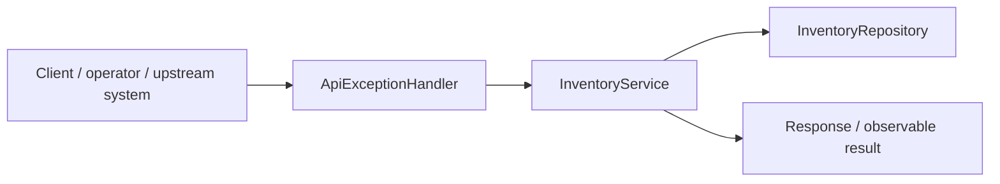
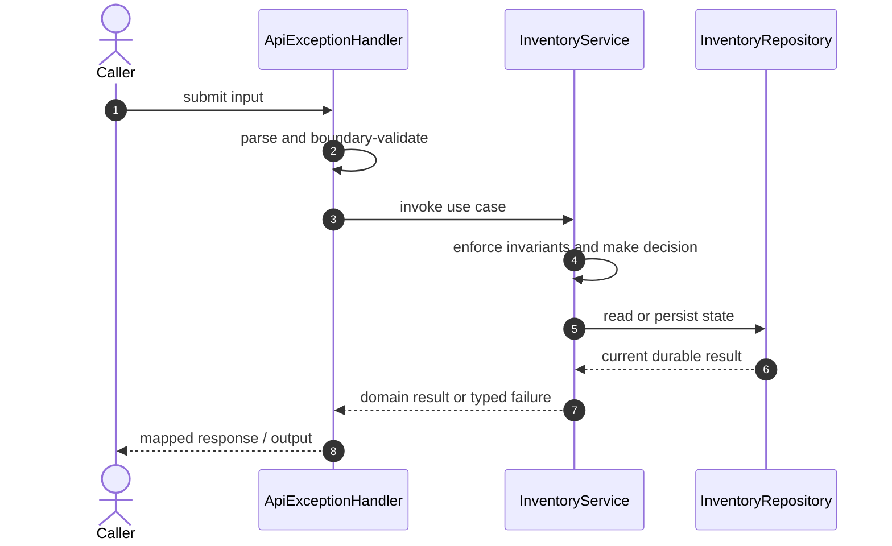

# Real-Time Inventory Code Flow

This is the single code-flow guide for the project. It connects the business request to concrete source files, explains both architectural levels, and shows where validation, state changes, asynchronous work, and responses occur.

## Scope and outcome

A runnable, interview-ready Java backend that combines three related problems:

The tracked production-code inventory used by this guide contains **14 source units** and **6 annotation-discovered HTTP operations**. Generated/build output and test sources are intentionally excluded from the runtime path.

## High-Level Design

At the system level, callers enter through an inbound adapter. The adapter owns transport concerns; application/domain code owns use-case decisions; repositories and gateways isolate state and external systems. Asynchronous adapters extend the flow without moving business invariants into controllers or consumers.

### Runtime stages

1. **Enter:** a request, command, scheduled trigger, protocol message, or UI action reaches the inbound boundary.
2. **Validate:** transport shape and required fields are rejected before domain mutation.
3. **Decide:** application/domain logic loads required state and applies invariants, idempotency, authorization, limits, or algorithms.
4. **Commit:** durable state changes pass through a repository/store; external calls pass through gateways; asynchronous work passes through message boundaries.
5. **Return and observe:** the adapter maps the result to an HTTP response, protocol response, CLI output, event, or metric.

## Low-Level Design

The low-level path keeps orchestration directional: inbound adapter → application/domain unit → persistence/outbound adapter. Contracts carry data between layers; configuration and security apply cross-cutting policy without becoming business logic.

### Component map

| Responsibility           | Concrete code                                                                                 |
| ------------------------ | --------------------------------------------------------------------------------------------- |
| Entry point              | `InventoryApplication`                                                                        |
| Supporting logic         | `LatestInventoryReducer`, `TransactionDeduplicator`, `InventoryProjection`, `ProcessedUpdate` |
| Inbound adapter          | `ApiExceptionHandler`, `InventoryController`, `TransactionController`                         |
| API/message contract     | `InventoryUpdateRequest`, `InventoryView`, `UpdateResult`                                     |
| Persistence adapter      | `InventoryRepository`, `ProcessedUpdateRepository`                                            |
| Application/domain logic | `InventoryService`                                                                            |

### Inbound operations

| Verb/trigger | Path or input                       | Owning code             |
| ------------ | ----------------------------------- | ----------------------- |
| `POST`       | `/inventory/updates`                | `InventoryController`   |
| `POST`       | `/inventory/updates/batch`          | `InventoryController`   |
| `GET`        | `/inventory/{sku}/stores/{storeId}` | `InventoryController`   |
| `GET`        | `/inventory/{sku}`                  | `InventoryController`   |
| `GET`        | `/inventory/{sku}/summary`          | `InventoryController`   |
| `POST`       | `/duplicates`                       | `TransactionController` |

## Detailed source walkthrough

Read this table top-down by category, then follow the linked files. “Key methods” are discovered from the checked-in implementation and identify useful debugging/interview entry points.

| Source file                                                                                                            | Role                     | Responsibility and important methods                                                                                                                                                    |
| ---------------------------------------------------------------------------------------------------------------------- | ------------------------ | --------------------------------------------------------------------------------------------------------------------------------------------------------------------------------------- |
| [`InventoryApplication.java`](./src/main/java/dev/portfolio/inventory/InventoryApplication.java)                       | Entry point              | InventoryApplication bootstraps the process and wires the runtime. Key methods: `main()`.                                                                                               |
| [`LatestInventoryReducer.java`](./src/main/java/dev/portfolio/inventory/algorithms/LatestInventoryReducer.java)        | Supporting logic         | LatestInventoryReducer provides a focused algorithm or shared implementation detail. Key methods: `Update()`, `Key()`, `latest()`.                                                      |
| [`TransactionDeduplicator.java`](./src/main/java/dev/portfolio/inventory/algorithms/TransactionDeduplicator.java)      | Supporting logic         | TransactionDeduplicator provides a focused algorithm or shared implementation detail. Key methods: `Transaction()`, `Fingerprint()`, `exactGroups()`, `withinWindow()`.                 |
| [`ApiExceptionHandler.java`](./src/main/java/dev/portfolio/inventory/api/ApiExceptionHandler.java)                     | Inbound adapter          | ApiExceptionHandler accepts an inbound call, validates its boundary contract, and delegates work.                                                                                       |
| [`InventoryController.java`](./src/main/java/dev/portfolio/inventory/api/InventoryController.java)                     | Inbound adapter          | InventoryController accepts an inbound call, validates its boundary contract, and delegates work. Key methods: `update()`, `batch()`, `get()`, `stores()`, `summary()`.                 |
| [`InventoryUpdateRequest.java`](./src/main/java/dev/portfolio/inventory/api/InventoryUpdateRequest.java)               | API/message contract     | InventoryUpdateRequest carries validated data across an API or messaging boundary.                                                                                                      |
| [`InventoryView.java`](./src/main/java/dev/portfolio/inventory/api/InventoryView.java)                                 | API/message contract     | InventoryView carries validated data across an API or messaging boundary.                                                                                                               |
| [`TransactionController.java`](./src/main/java/dev/portfolio/inventory/api/TransactionController.java)                 | Inbound adapter          | TransactionController accepts an inbound call, validates its boundary contract, and delegates work. Key methods: `TransactionRequest()`, `duplicates()`.                                |
| [`UpdateResult.java`](./src/main/java/dev/portfolio/inventory/api/UpdateResult.java)                                   | API/message contract     | UpdateResult carries validated data across an API or messaging boundary.                                                                                                                |
| [`InventoryProjection.java`](./src/main/java/dev/portfolio/inventory/persistence/InventoryProjection.java)             | Supporting logic         | InventoryProjection provides a focused algorithm or shared implementation detail. Key methods: `apply()`, `getId()`, `getSku()`, `getStoreId()`, `getQuantity()`, `getSourceVersion()`. |
| [`InventoryRepository.java`](./src/main/java/dev/portfolio/inventory/persistence/InventoryRepository.java)             | Persistence adapter      | InventoryRepository reads or writes durable state behind a storage boundary.                                                                                                            |
| [`ProcessedUpdate.java`](./src/main/java/dev/portfolio/inventory/persistence/ProcessedUpdate.java)                     | Supporting logic         | ProcessedUpdate provides a focused algorithm or shared implementation detail.                                                                                                           |
| [`ProcessedUpdateRepository.java`](./src/main/java/dev/portfolio/inventory/persistence/ProcessedUpdateRepository.java) | Persistence adapter      | ProcessedUpdateRepository reads or writes durable state behind a storage boundary.                                                                                                      |
| [`InventoryService.java`](./src/main/java/dev/portfolio/inventory/service/InventoryService.java)                       | Application/domain logic | InventoryService coordinates the use case and enforces domain decisions. Key methods: `apply()`, `get()`, `storesForSku()`, `summary()`, `SkuSummary()`.                                |

## End-to-end code-flow narrative

1. Start at `ApiExceptionHandler`. It receives the external input and should perform only boundary parsing, authentication/authorization handoff, and request validation.
2. Follow the call into `InventoryService`. This is the principal place to explain the use case, invariant checks, deduplication/concurrency decision, and success/failure result.
3. Continue into `InventoryRepository` for the durable or in-memory state transition. Transaction and consistency guarantees belong at this boundary, not in response mapping.
4. This flow completes synchronously; background work is not part of the primary checked-in path.
5. External-system behavior is either absent or represented behind another listed adapter.
6. Return to `ApiExceptionHandler`, where typed outcomes become the public response or protocol result. Logging and metrics should preserve correlation identifiers without leaking secrets.

## Failure and correctness checkpoints

- **Invalid input:** rejected at the inbound contract before state mutation.
- **Domain conflict:** returned as a typed result; do not hide it as an infrastructure exception.
- **Duplicate or concurrent work:** handled where the project’s idempotency, locking, ordering, or atomic data structure is implemented.
- **Storage/integration failure:** transaction is rolled back or the operation remains safely retryable.
- **Async failure:** consumer retries must preserve idempotency; poison work must become observable rather than loop silently.
- **Observability:** trace the same request/correlation identity through inbound, domain, persistence, and async logs.

## How to trace a scenario in the debugger

1. Choose one operation from the inbound-operations table or the project’s demo script.
2. Break at `ApiExceptionHandler`, then step into `InventoryService` rather than framework internals.
3. Inspect the command/request object immediately after validation.
4. Stop before and after the call to `InventoryRepository` to compare intended and durable state.
5. If messaging exists, capture the emitted identifier and continue from `the consumer/worker`.
6. Confirm the final public result and the corresponding logs/metrics.

## Related project documentation

- [Project README](./README.md)
- Architecture material is contained in this guide.
- [Interview guide](./INTERVIEW_GUIDE.md)
