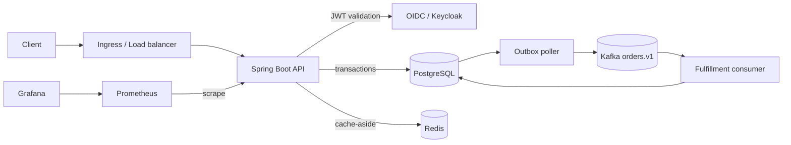

# Reliable Order Platform

A production-shaped **Java 21 modular monolith** designed to teach the high-value backend, distributed-systems, cloud, and operations concepts that recur in senior interviews. It intentionally uses one deployable service: PostgreSQL owns durable state, Redis accelerates reads, and Kafka decouples fulfillment. The transactional outbox closes the database/event dual-write gap.

## Architecture



### Create-order request and data flow

1. Ingress terminates TLS and forwards the bearer token and request.
2. Spring Security validates issuer/signature and maps realm roles.
3. The API checks `Idempotency-Key`, validates input, and writes order + audit + outbox in one PostgreSQL transaction.
4. Only after commit does the client receive `201`. Concurrent retries converge through a unique database constraint.
5. The poller locks an outbox batch, sends keyed events with Kafka `acks=all`, then marks them published.
6. The consumer records `eventId` in `processed_events`; duplicate deliveries become no-ops. It transitions the order to `ACCEPTED` and evicts stale cache data.

This is **at-least-once delivery with idempotent effects**, not a claim of magical end-to-end exactly-once processing.

## Run locally

Prerequisites: Java 21, Docker Desktop, and Docker Compose.

```bash
./mvnw verify
docker compose up --build
```

On Windows, the quickest evidence-based demo starts the stack and verifies JWT authentication, order persistence, Kafka fulfillment, health, and metrics:

```powershell
.\scripts\demo.ps1
```

Request a development token, then create and read an order:

```bash
TOKEN=$(curl -s -X POST http://localhost:8081/realms/orders/protocol/openid-connect/token \
  -d client_id=order-cli -d username=alice -d password=alice -d grant_type=password | jq -r .access_token)
curl -i -X POST http://localhost:8080/api/v1/orders \
  -H "Authorization: Bearer $TOKEN" -H "Idempotency-Key: demo-001" \
  -H "Content-Type: application/json" -d '{"sku":"CHAIR-42","quantity":2,"unitPrice":149.99}'
curl -H "Authorization: Bearer $TOKEN" http://localhost:8080/api/v1/orders/ORDER_ID
```

Endpoints: API `8080`, Keycloak `8081`, Prometheus `9090`, Grafana `3000`. Development credentials are deliberately local-only. Never commit production secrets.

## Repository map

| Path | Responsibility |
|---|---|
| `order` | REST API, aggregate, validation, idempotent application service |
| `outbox` | reliable event publication and consumer deduplication |
| `fulfillment` | asynchronous business reaction |
| `audit` | durable actor/action trail |
| `config` | JWT authorization and bounded Redis cache |
| `db/migration` | reviewed, repeatable schema evolution |
| `ops` | local identity and monitoring configuration |
| `k8s` | deployment, probes, ingress, HPA, disruption budget |
| `infra/terraform` | VPC, RDS, ElastiCache, MSK Serverless, ECR, audit bucket |
| `.github/workflows` | Java 21 verification and image build |

## API and data model

`POST /api/v1/orders` requires role `CUSTOMER` or `SUPPORT`, a JWT, and `Idempotency-Key`. `GET /api/v1/orders/{id}` permits the owning subject or support. Money uses decimal rather than floating point. Optimistic locking prevents lost updates. Indexes support idempotency, customer history, outbox scanning, and audit lookup.

Redis uses cache-aside with a five-minute TTL. PostgreSQL remains authoritative. The custom `CacheErrorHandler` converts Redis errors to misses and logs them, so an outage costs latency rather than correctness. Do not cache unbounded queries, secrets, or rapidly changing inventory.

## Deployment

The Kubernetes manifest includes rolling updates, explicit resources, startup/readiness/liveness probes, ingress, HPA, and a disruption budget. Replace sample endpoints and the placeholder Secret with External Secrets + AWS Secrets Manager. Run database migrations as a controlled pre-deploy job for multi-version rollouts rather than letting every replica race on startup.

Terraform is an interview-sized AWS baseline, not a one-click production landing zone. It provisions private data services and deliberately omits EKS/IAM/Route53/ACM organization-specific policy. Production adds multiple NAT gateways, WAF, private endpoints, MSK IAM client configuration, secret rotation, alarms, budgets, backups tested by restore, and an EKS module or an existing platform cluster.

See [INTERVIEW_GUIDE.md](INTERVIEW_GUIDE.md) for design decisions and [RUNBOOK.md](RUNBOOK.md) for failure drills.
