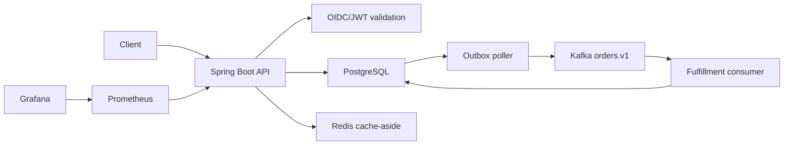
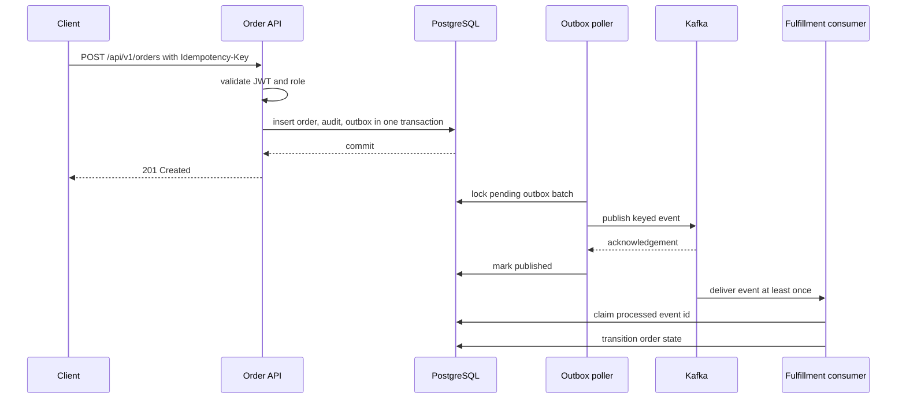
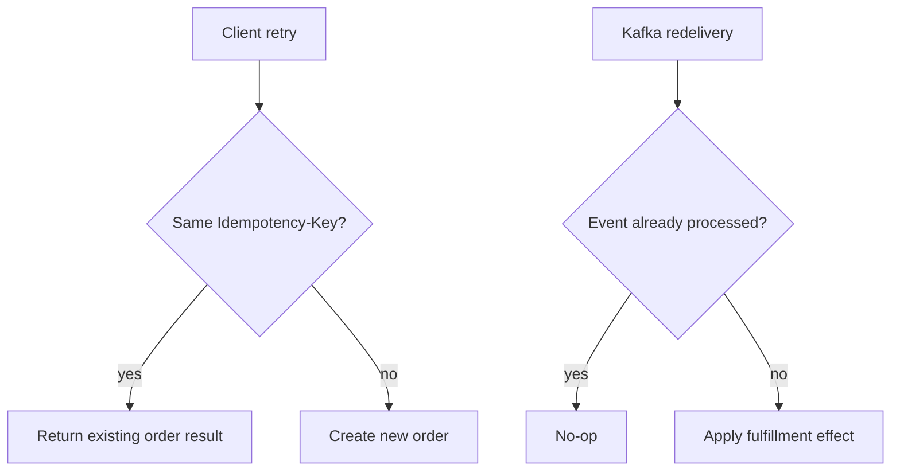

# Reliable Order Platform Diagrams

## Architecture

```mermaid
flowchart LR
    Client["Client"] --> API["Spring Boot API"]
    API --> Auth["OIDC/JWT validation"]
    API --> DB["PostgreSQL"]
    API --> Redis["Redis cache-aside"]
    DB --> Outbox["Outbox poller"]
    Outbox --> Kafka["Kafka orders.v1"]
    Kafka --> Consumer["Fulfillment consumer"]
    Consumer --> DB
    Prom["Prometheus"] --> API
    Grafana["Grafana"] --> Prom
```

## Create Order Flow

```mermaid
sequenceDiagram
    participant C as Client
    participant API as Order API
    participant DB as PostgreSQL
    participant P as Outbox poller
    participant K as Kafka
    participant F as Fulfillment consumer
    C->>API: POST /api/v1/orders with Idempotency-Key
    API->>API: validate JWT and role
    API->>DB: insert order, audit, outbox in one transaction
    DB-->>API: commit
    API-->>C: 201 Created
    P->>DB: lock pending outbox batch
    P->>K: publish keyed event
    K-->>P: acknowledgement
    P->>DB: mark published
    K->>F: deliver event at least once
    F->>DB: claim processed event id
    F->>DB: transition order state
```

## Duplicate Handling

```mermaid
flowchart TB
    Retry["Client retry"] --> Idempotency{"Same Idempotency-Key?"}
    Idempotency -->|yes| Existing["Return existing order result"]
    Idempotency -->|no| NewOrder["Create new order"]
    KafkaRedelivery["Kafka redelivery"] --> Processed{"Event already processed?"}
    Processed -->|yes| Noop["No-op"]
    Processed -->|no| Apply["Apply fulfillment effect"]
```
