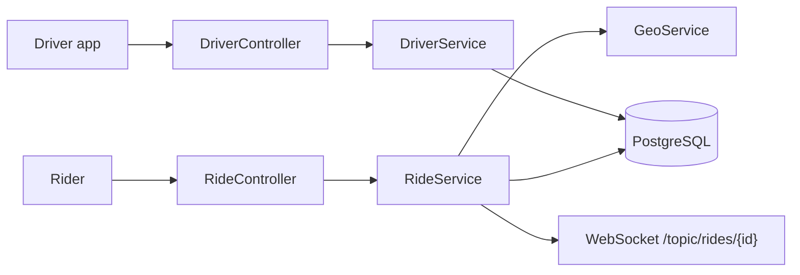
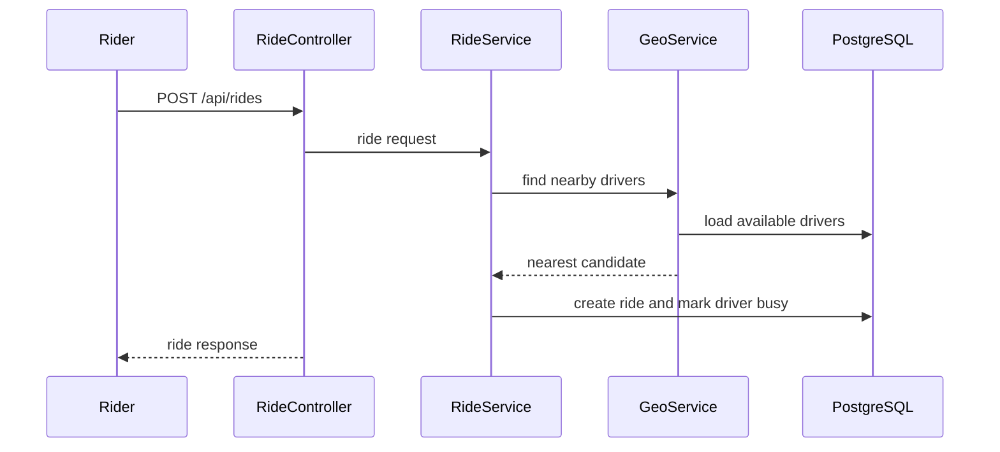
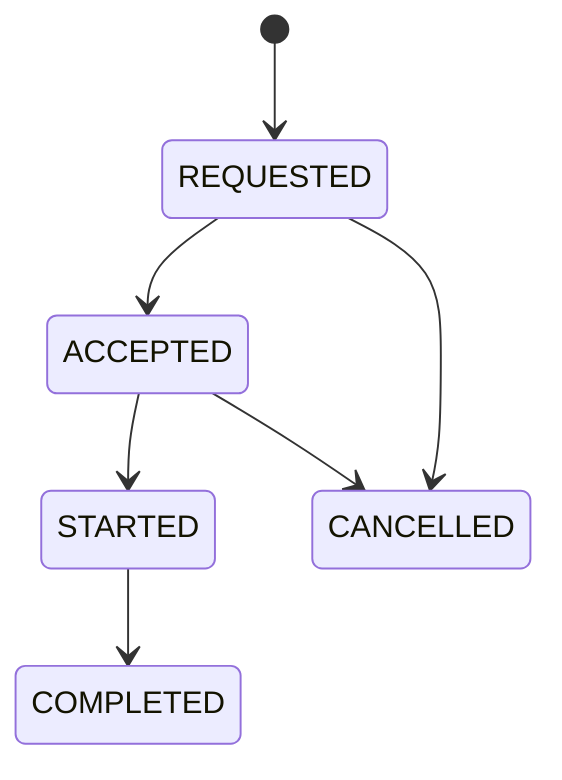

# Ride-Sharing Backend Diagrams

## Component View

```mermaid
flowchart LR
    Rider["Rider"] --> RideApi["RideController"]
    Driver["Driver app"] --> DriverApi["DriverController"]
    RideApi --> RideService["RideService"]
    DriverApi --> DriverService["DriverService"]
    RideService --> Geo["GeoService"]
    DriverService --> DB[("PostgreSQL")]
    RideService --> DB
    RideService --> WS["WebSocket /topic/rides/{id}"]
```

## Matching Flow

```mermaid
sequenceDiagram
    participant R as Rider
    participant API as RideController
    participant S as RideService
    participant G as GeoService
    participant DB as PostgreSQL
    R->>API: POST /api/rides
    API->>S: ride request
    S->>G: find nearby drivers
    G->>DB: load available drivers
    G-->>S: nearest candidate
    S->>DB: create ride and mark driver busy
    API-->>R: ride response
```

## Ride State Flow

```mermaid
stateDiagram-v2
    [*] --> REQUESTED
    REQUESTED --> ACCEPTED
    ACCEPTED --> STARTED
    STARTED --> COMPLETED
    REQUESTED --> CANCELLED
    ACCEPTED --> CANCELLED
```
