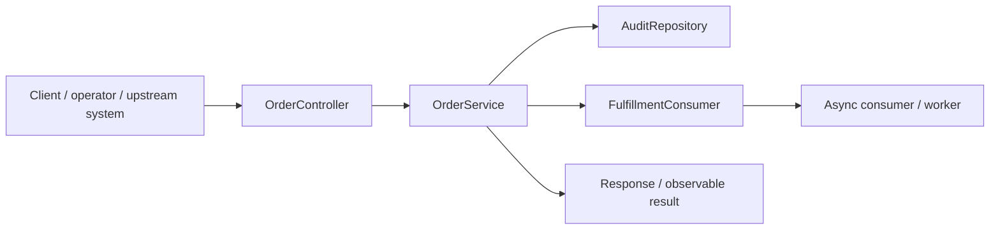
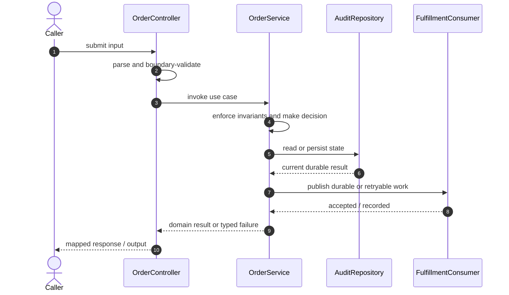

# Reliable Order Platform Code Flow

This is the single code-flow guide for the project. It connects the business request to concrete source files, explains both architectural levels, and shows where validation, state changes, asynchronous work, and responses occur.

## Scope and outcome

A production-shaped **Java 21 modular monolith** designed to teach the high-value backend, distributed-systems, cloud, and operations concepts that recur in senior interviews. It intentionally uses one deployable service: PostgreSQL owns durable state, Redis accelerates reads, and Kafka decouples fulfillment. The transactional outbox closes the database/event dual-write gap.

The tracked production-code inventory used by this guide contains **18 source units** and **2 annotation-discovered HTTP operations**. Generated/build output and test sources are intentionally excluded from the runtime path.

## High-Level Design

At the system level, callers enter through an inbound adapter. The adapter owns transport concerns; application/domain code owns use-case decisions; repositories and gateways isolate state and external systems. Asynchronous adapters extend the flow without moving business invariants into controllers or consumers.

### Runtime stages

1. **Enter:** a request, command, scheduled trigger, protocol message, or UI action reaches the inbound boundary.
2. **Validate:** transport shape and required fields are rejected before domain mutation.
3. **Decide:** application/domain logic loads required state and applies invariants, idempotency, authorization, limits, or algorithms.
4. **Commit:** durable state changes pass through a repository/store; external calls pass through gateways; asynchronous work passes through message boundaries.
5. **Return and observe:** the adapter maps the result to an HTTP response, protocol response, CLI output, event, or metric.

## Low-Level Design

The low-level path keeps orchestration directional: inbound adapter → application/domain unit → persistence/outbound adapter. Contracts carry data between layers; configuration and security apply cross-cutting policy without becoming business logic.

### Component map

| Responsibility           | Concrete code                                                                        |
| ------------------------ | ------------------------------------------------------------------------------------ |
| Entry point              | `OrderPlatformApplication`                                                           |
| Domain/data model        | `AuditRecord`, `CustomerOrder`                                                       |
| Persistence adapter      | `AuditRepository`, `OrderRepository`, `OutboxRepository`, `ProcessedEventRepository` |
| Configuration/security   | `CacheConfig`, `SecurityConfig`                                                      |
| Messaging/async adapter  | `FulfillmentConsumer`, `OutboxPublisher`                                             |
| Inbound adapter          | `OrderController`, `ApiExceptionHandler`                                             |
| Supporting logic         | `OrderDtos`, `OrderStatus`                                                           |
| Application/domain logic | `OrderService`                                                                       |
| API/message contract     | `OutboxEvent`, `ProcessedEvent`                                                      |

### Inbound operations

| Verb/trigger | Path or input                | Owning code       |
| ------------ | ---------------------------- | ----------------- |
| `POST`       | `(class-level/default path)` | `OrderController` |
| `GET`        | `/{id}`                      | `OrderController` |

## Detailed source walkthrough

Read this table top-down by category, then follow the linked files. “Key methods” are discovered from the checked-in implementation and identify useful debugging/interview entry points.

| Source file                                                                                                  | Role                     | Responsibility and important methods                                                                                                                                                                             |
| ------------------------------------------------------------------------------------------------------------ | ------------------------ | ---------------------------------------------------------------------------------------------------------------------------------------------------------------------------------------------------------------- |
| [`OrderPlatformApplication.java`](./src/main/java/dev/interview/orders/OrderPlatformApplication.java)        | Entry point              | OrderPlatformApplication bootstraps the process and wires the runtime. Key methods: `main()`.                                                                                                                    |
| [`AuditRecord.java`](./src/main/java/dev/interview/orders/audit/AuditRecord.java)                            | Domain/data model        | AuditRecord represents domain state, identity, or an invariant-bearing value.                                                                                                                                    |
| [`AuditRepository.java`](./src/main/java/dev/interview/orders/audit/AuditRepository.java)                    | Persistence adapter      | AuditRepository reads or writes durable state behind a storage boundary.                                                                                                                                         |
| [`CacheConfig.java`](./src/main/java/dev/interview/orders/config/CacheConfig.java)                           | Configuration/security   | CacheConfig defines runtime wiring, authentication, authorization, or cross-cutting policy. Key methods: `handleCacheGetError()`, `handleCachePutError()`, `handleCacheEvictError()`, `handleCacheClearError()`. |
| [`SecurityConfig.java`](./src/main/java/dev/interview/orders/config/SecurityConfig.java)                     | Configuration/security   | SecurityConfig defines runtime wiring, authentication, authorization, or cross-cutting policy.                                                                                                                   |
| [`FulfillmentConsumer.java`](./src/main/java/dev/interview/orders/fulfillment/FulfillmentConsumer.java)      | Messaging/async adapter  | FulfillmentConsumer publishes, consumes, retries, or records asynchronous work. Key methods: `consume()`.                                                                                                        |
| [`CustomerOrder.java`](./src/main/java/dev/interview/orders/order/CustomerOrder.java)                        | Domain/data model        | CustomerOrder represents domain state, identity, or an invariant-bearing value. Key methods: `getId()`, `getCustomerId()`, `getSku()`, `getQuantity()`, `getUnitPrice()`, `getStatus()`.                         |
| [`OrderController.java`](./src/main/java/dev/interview/orders/order/OrderController.java)                    | Inbound adapter          | OrderController accepts an inbound call, validates its boundary contract, and delegates work. Key methods: `create()`, `get()`.                                                                                  |
| [`OrderDtos.java`](./src/main/java/dev/interview/orders/order/OrderDtos.java)                                | Supporting logic         | OrderDtos provides a focused algorithm or shared implementation detail. Key methods: `CreateOrder()`, `OrderView()`.                                                                                             |
| [`OrderRepository.java`](./src/main/java/dev/interview/orders/order/OrderRepository.java)                    | Persistence adapter      | OrderRepository reads or writes durable state behind a storage boundary.                                                                                                                                         |
| [`OrderService.java`](./src/main/java/dev/interview/orders/order/OrderService.java)                          | Application/domain logic | OrderService coordinates the use case and enforces domain decisions. Key methods: `create()`, `get()`.                                                                                                           |
| [`OrderStatus.java`](./src/main/java/dev/interview/orders/order/OrderStatus.java)                            | Supporting logic         | OrderStatus provides a focused algorithm or shared implementation detail.                                                                                                                                        |
| [`OutboxEvent.java`](./src/main/java/dev/interview/orders/outbox/OutboxEvent.java)                           | API/message contract     | OutboxEvent carries validated data across an API or messaging boundary. Key methods: `getId()`, `getAggregateId()`, `getEventType()`, `getPayload()`, `markPublished()`.                                         |
| [`OutboxPublisher.java`](./src/main/java/dev/interview/orders/outbox/OutboxPublisher.java)                   | Messaging/async adapter  | OutboxPublisher publishes, consumes, retries, or records asynchronous work. Key methods: `publish()`.                                                                                                            |
| [`OutboxRepository.java`](./src/main/java/dev/interview/orders/outbox/OutboxRepository.java)                 | Persistence adapter      | OutboxRepository reads or writes durable state behind a storage boundary.                                                                                                                                        |
| [`ProcessedEvent.java`](./src/main/java/dev/interview/orders/outbox/ProcessedEvent.java)                     | API/message contract     | ProcessedEvent carries validated data across an API or messaging boundary.                                                                                                                                       |
| [`ProcessedEventRepository.java`](./src/main/java/dev/interview/orders/outbox/ProcessedEventRepository.java) | Persistence adapter      | ProcessedEventRepository reads or writes durable state behind a storage boundary.                                                                                                                                |
| [`ApiExceptionHandler.java`](./src/main/java/dev/interview/orders/web/ApiExceptionHandler.java)              | Inbound adapter          | ApiExceptionHandler accepts an inbound call, validates its boundary contract, and delegates work.                                                                                                                |

## End-to-end code-flow narrative

1. Start at `OrderController`. It receives the external input and should perform only boundary parsing, authentication/authorization handoff, and request validation.
2. Follow the call into `OrderService`. This is the principal place to explain the use case, invariant checks, deduplication/concurrency decision, and success/failure result.
3. Continue into `AuditRepository` for the durable or in-memory state transition. Transaction and consistency guarantees belong at this boundary, not in response mapping.
4. Follow `FulfillmentConsumer` when the synchronous decision emits follow-up work. Verify retry, duplicate-delivery, and dead-letter behavior independently of the request thread.
5. External-system behavior is either absent or represented behind another listed adapter.
6. Return to `OrderController`, where typed outcomes become the public response or protocol result. Logging and metrics should preserve correlation identifiers without leaking secrets.

## Failure and correctness checkpoints

- **Invalid input:** rejected at the inbound contract before state mutation.
- **Domain conflict:** returned as a typed result; do not hide it as an infrastructure exception.
- **Duplicate or concurrent work:** handled where the project’s idempotency, locking, ordering, or atomic data structure is implemented.
- **Storage/integration failure:** transaction is rolled back or the operation remains safely retryable.
- **Async failure:** consumer retries must preserve idempotency; poison work must become observable rather than loop silently.
- **Observability:** trace the same request/correlation identity through inbound, domain, persistence, and async logs.

## How to trace a scenario in the debugger

1. Choose one operation from the inbound-operations table or the project’s demo script.
2. Break at `OrderController`, then step into `OrderService` rather than framework internals.
3. Inspect the command/request object immediately after validation.
4. Stop before and after the call to `AuditRepository` to compare intended and durable state.
5. If messaging exists, capture the emitted identifier and continue from `FulfillmentConsumer`.
6. Confirm the final public result and the corresponding logs/metrics.

## Related project documentation

- [Project README](./README.md)
- [Specialized diagrams](./docs/DIAGRAMS.md)
- [Interview guide](./docs/INTERVIEW_GUIDE.md)
