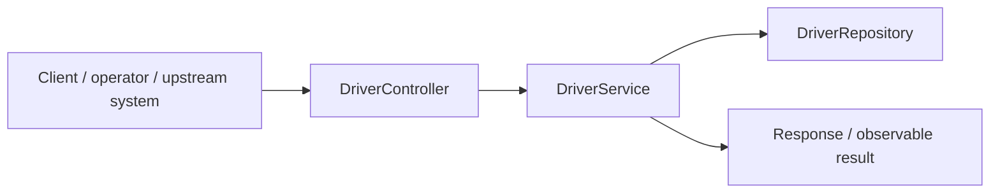
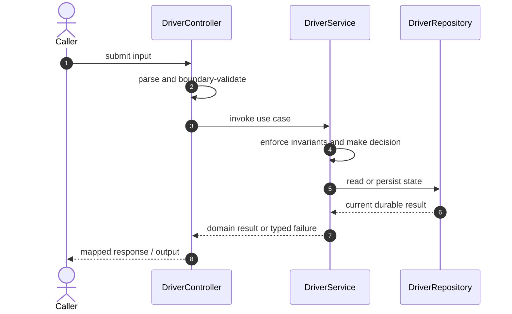

# Ride Sharing Backend Code Flow

This is the single code-flow guide for the project. It connects the business request to concrete source files, explains both architectural levels, and shows where validation, state changes, asynchronous work, and responses occur.

## Scope and outcome

A Spring Boot ride-sharing backend with driver location updates, nearby-driver geo queries, ride matching, trip lifecycle transitions, and WebSocket ride updates.

The tracked production-code inventory used by this guide contains **24 source units** and **6 annotation-discovered HTTP operations**. Generated/build output and test sources are intentionally excluded from the runtime path.

## High-Level Design

At the system level, callers enter through an inbound adapter. The adapter owns transport concerns; application/domain code owns use-case decisions; repositories and gateways isolate state and external systems. Asynchronous adapters extend the flow without moving business invariants into controllers or consumers.

### Runtime stages

1. **Enter:** a request, command, scheduled trigger, protocol message, or UI action reaches the inbound boundary.
2. **Validate:** transport shape and required fields are rejected before domain mutation.
3. **Decide:** application/domain logic loads required state and applies invariants, idempotency, authorization, limits, or algorithms.
4. **Commit:** durable state changes pass through a repository/store; external calls pass through gateways; asynchronous work passes through message boundaries.
5. **Return and observe:** the adapter maps the result to an HTTP response, protocol response, CLI output, event, or metric.

## Low-Level Design

The low-level path keeps orchestration directional: inbound adapter → application/domain unit → persistence/outbound adapter. Contracts carry data between layers; configuration and security apply cross-cutting policy without becoming business logic.

### Component map

| Responsibility           | Concrete code                                                                                                                                            |
| ------------------------ | -------------------------------------------------------------------------------------------------------------------------------------------------------- |
| Entry point              | `RideSharingApplication`                                                                                                                                 |
| Configuration/security   | `WebSocketConfig`                                                                                                                                        |
| API/message contract     | `CreateDriverRequest`, `DriverResponse`, `NearbyDriverResponse`, `UpdateDriverLocationRequest`, `RideRequest`, `RideResponse`, `UpdateRideStatusRequest` |
| Supporting logic         | `Driver`, `DriverStatus`, `ApiError`, `DomainException`, `NotFoundException`, `RideStatus`                                                               |
| Inbound adapter          | `DriverController`, `GlobalExceptionHandler`, `RideController`                                                                                           |
| Persistence adapter      | `DriverRepository`, `RideRepository`                                                                                                                     |
| Application/domain logic | `DriverService`, `GeoService`, `RideService`                                                                                                             |
| Domain/data model        | `Ride`                                                                                                                                                   |

### Inbound operations

| Verb/trigger | Path or input                | Owning code        |
| ------------ | ---------------------------- | ------------------ |
| `POST`       | `(class-level/default path)` | `DriverController` |
| `PATCH`      | `/{id}/location`             | `DriverController` |
| `GET`        | `/nearby`                    | `DriverController` |
| `POST`       | `(class-level/default path)` | `RideController`   |
| `GET`        | `/{id}`                      | `RideController`   |
| `PATCH`      | `/{id}/status`               | `RideController`   |

## Detailed source walkthrough

Read this table top-down by category, then follow the linked files. “Key methods” are discovered from the checked-in implementation and identify useful debugging/interview entry points.

| Source file                                                                                                                  | Role                     | Responsibility and important methods                                                                                                                                                             |
| ---------------------------------------------------------------------------------------------------------------------------- | ------------------------ | ------------------------------------------------------------------------------------------------------------------------------------------------------------------------------------------------ |
| [`RideSharingApplication.java`](./src/main/java/com/example/capstone/rideshare/RideSharingApplication.java)                  | Entry point              | RideSharingApplication bootstraps the process and wires the runtime. Key methods: `main()`.                                                                                                      |
| [`WebSocketConfig.java`](./src/main/java/com/example/capstone/rideshare/config/WebSocketConfig.java)                         | Configuration/security   | WebSocketConfig defines runtime wiring, authentication, authorization, or cross-cutting policy. Key methods: `configureMessageBroker()`, `registerStompEndpoints()`.                             |
| [`CreateDriverRequest.java`](./src/main/java/com/example/capstone/rideshare/driver/CreateDriverRequest.java)                 | API/message contract     | CreateDriverRequest carries validated data across an API or messaging boundary.                                                                                                                  |
| [`Driver.java`](./src/main/java/com/example/capstone/rideshare/driver/Driver.java)                                           | Supporting logic         | Driver provides a focused algorithm or shared implementation detail. Key methods: `updateLocation()`, `markBusy()`, `markAvailable()`, `getId()`, `getName()`, `getStatus()`.                    |
| [`DriverController.java`](./src/main/java/com/example/capstone/rideshare/driver/DriverController.java)                       | Inbound adapter          | DriverController accepts an inbound call, validates its boundary contract, and delegates work. Key methods: `create()`, `updateLocation()`, `nearby()`.                                          |
| [`DriverRepository.java`](./src/main/java/com/example/capstone/rideshare/driver/DriverRepository.java)                       | Persistence adapter      | DriverRepository reads or writes durable state behind a storage boundary.                                                                                                                        |
| [`DriverResponse.java`](./src/main/java/com/example/capstone/rideshare/driver/DriverResponse.java)                           | API/message contract     | DriverResponse carries validated data across an API or messaging boundary. Key methods: `from()`.                                                                                                |
| [`DriverService.java`](./src/main/java/com/example/capstone/rideshare/driver/DriverService.java)                             | Application/domain logic | DriverService coordinates the use case and enforces domain decisions. Key methods: `create()`, `updateLocation()`, `nearby()`.                                                                   |
| [`DriverStatus.java`](./src/main/java/com/example/capstone/rideshare/driver/DriverStatus.java)                               | Supporting logic         | DriverStatus provides a focused algorithm or shared implementation detail.                                                                                                                       |
| [`NearbyDriverResponse.java`](./src/main/java/com/example/capstone/rideshare/driver/NearbyDriverResponse.java)               | API/message contract     | NearbyDriverResponse carries validated data across an API or messaging boundary. Key methods: `from()`.                                                                                          |
| [`UpdateDriverLocationRequest.java`](./src/main/java/com/example/capstone/rideshare/driver/UpdateDriverLocationRequest.java) | API/message contract     | UpdateDriverLocationRequest carries validated data across an API or messaging boundary.                                                                                                          |
| [`ApiError.java`](./src/main/java/com/example/capstone/rideshare/error/ApiError.java)                                        | Supporting logic         | ApiError provides a focused algorithm or shared implementation detail. Key methods: `of()`.                                                                                                      |
| [`DomainException.java`](./src/main/java/com/example/capstone/rideshare/error/DomainException.java)                          | Supporting logic         | DomainException provides a focused algorithm or shared implementation detail.                                                                                                                    |
| [`GlobalExceptionHandler.java`](./src/main/java/com/example/capstone/rideshare/error/GlobalExceptionHandler.java)            | Inbound adapter          | GlobalExceptionHandler accepts an inbound call, validates its boundary contract, and delegates work. Key methods: `handleNotFound()`, `handleDomain()`, `handleValidation()`.                    |
| [`NotFoundException.java`](./src/main/java/com/example/capstone/rideshare/error/NotFoundException.java)                      | Supporting logic         | NotFoundException provides a focused algorithm or shared implementation detail.                                                                                                                  |
| [`GeoService.java`](./src/main/java/com/example/capstone/rideshare/geo/GeoService.java)                                      | Application/domain logic | GeoService coordinates the use case and enforces domain decisions. Key methods: `distanceKm()`.                                                                                                  |
| [`Ride.java`](./src/main/java/com/example/capstone/rideshare/ride/Ride.java)                                                 | Domain/data model        | Ride represents domain state, identity, or an invariant-bearing value. Key methods: `transitionTo()`, `getId()`, `getRiderId()`, `getDriverId()`, `getPickupLatitude()`, `getPickupLongitude()`. |
| [`RideController.java`](./src/main/java/com/example/capstone/rideshare/ride/RideController.java)                             | Inbound adapter          | RideController accepts an inbound call, validates its boundary contract, and delegates work. Key methods: `request()`, `get()`, `updateStatus()`.                                                |
| [`RideRepository.java`](./src/main/java/com/example/capstone/rideshare/ride/RideRepository.java)                             | Persistence adapter      | RideRepository reads or writes durable state behind a storage boundary.                                                                                                                          |
| [`RideRequest.java`](./src/main/java/com/example/capstone/rideshare/ride/RideRequest.java)                                   | API/message contract     | RideRequest carries validated data across an API or messaging boundary.                                                                                                                          |
| [`RideResponse.java`](./src/main/java/com/example/capstone/rideshare/ride/RideResponse.java)                                 | API/message contract     | RideResponse carries validated data across an API or messaging boundary. Key methods: `from()`.                                                                                                  |
| [`RideService.java`](./src/main/java/com/example/capstone/rideshare/ride/RideService.java)                                   | Application/domain logic | RideService coordinates the use case and enforces domain decisions. Key methods: `request()`, `get()`, `updateStatus()`.                                                                         |
| [`RideStatus.java`](./src/main/java/com/example/capstone/rideshare/ride/RideStatus.java)                                     | Supporting logic         | RideStatus provides a focused algorithm or shared implementation detail.                                                                                                                         |
| [`UpdateRideStatusRequest.java`](./src/main/java/com/example/capstone/rideshare/ride/UpdateRideStatusRequest.java)           | API/message contract     | UpdateRideStatusRequest carries validated data across an API or messaging boundary.                                                                                                              |

## End-to-end code-flow narrative

1. Start at `DriverController`. It receives the external input and should perform only boundary parsing, authentication/authorization handoff, and request validation.
2. Follow the call into `DriverService`. This is the principal place to explain the use case, invariant checks, deduplication/concurrency decision, and success/failure result.
3. Continue into `DriverRepository` for the durable or in-memory state transition. Transaction and consistency guarantees belong at this boundary, not in response mapping.
4. This flow completes synchronously; background work is not part of the primary checked-in path.
5. External-system behavior is either absent or represented behind another listed adapter.
6. Return to `DriverController`, where typed outcomes become the public response or protocol result. Logging and metrics should preserve correlation identifiers without leaking secrets.

## Failure and correctness checkpoints

- **Invalid input:** rejected at the inbound contract before state mutation.
- **Domain conflict:** returned as a typed result; do not hide it as an infrastructure exception.
- **Duplicate or concurrent work:** handled where the project’s idempotency, locking, ordering, or atomic data structure is implemented.
- **Storage/integration failure:** transaction is rolled back or the operation remains safely retryable.
- **Async failure:** consumer retries must preserve idempotency; poison work must become observable rather than loop silently.
- **Observability:** trace the same request/correlation identity through inbound, domain, persistence, and async logs.

## How to trace a scenario in the debugger

1. Choose one operation from the inbound-operations table or the project’s demo script.
2. Break at `DriverController`, then step into `DriverService` rather than framework internals.
3. Inspect the command/request object immediately after validation.
4. Stop before and after the call to `DriverRepository` to compare intended and durable state.
5. If messaging exists, capture the emitted identifier and continue from `the consumer/worker`.
6. Confirm the final public result and the corresponding logs/metrics.

## Related project documentation

- [Project README](./README.md)
- [Specialized diagrams](./docs/DIAGRAMS.md)
- [Interview guide](./docs/INTERVIEW_GUIDE.md)
