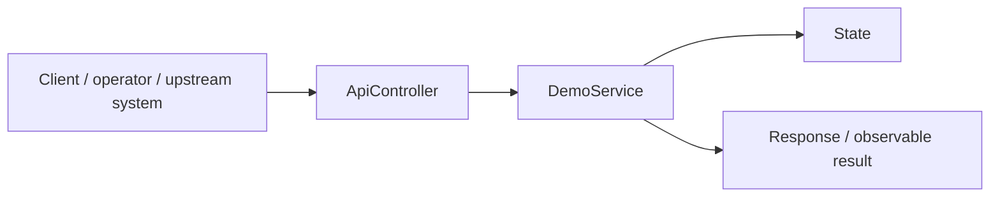
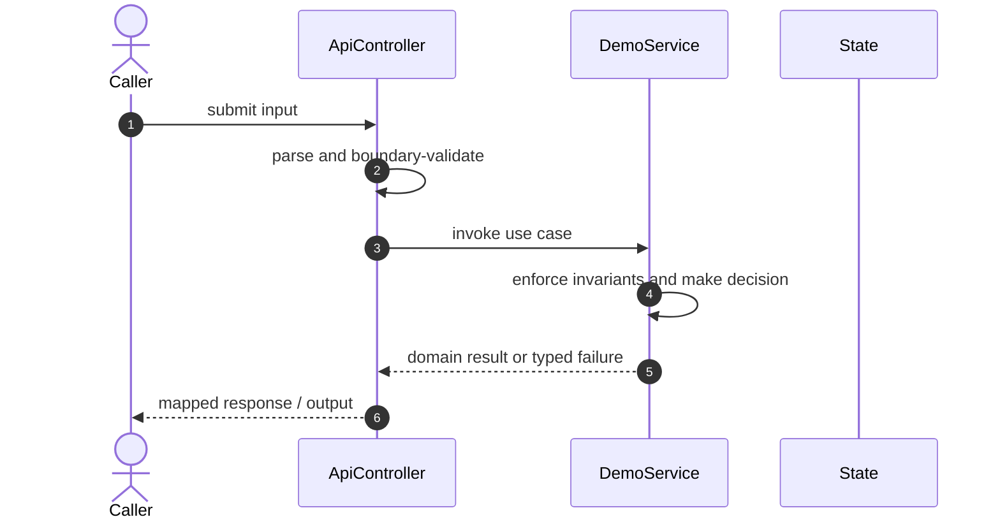

# Stripe Ledger Reconciliation Code Flow

This is the single code-flow guide for the project. It connects the business request to concrete source files, explains both architectural levels, and shows where validation, state changes, asynchronous work, and responses occur.

## Scope and outcome

An interview-ready, runnable system for idempotent payments, immutable double-entry accounting, at-least-once Stripe-style webhooks, fast balances, asynchronous sharded reconciliation, guarded adjustments, and deterministic failure simulation.

The tracked production-code inventory used by this guide contains **13 source units** and **20 annotation-discovered HTTP operations**. Generated/build output and test sources are intentionally excluded from the runtime path.

## High-Level Design

At the system level, callers enter through an inbound adapter. The adapter owns transport concerns; application/domain code owns use-case decisions; repositories and gateways isolate state and external systems. Asynchronous adapters extend the flow without moving business invariants into controllers or consumers.

### Runtime stages

1. **Enter:** a request, command, scheduled trigger, protocol message, or UI action reaches the inbound boundary.
2. **Validate:** transport shape and required fields are rejected before domain mutation.
3. **Decide:** application/domain logic loads required state and applies invariants, idempotency, authorization, limits, or algorithms.
4. **Commit:** durable state changes pass through a repository/store; external calls pass through gateways; asynchronous work passes through message boundaries.
5. **Return and observe:** the adapter maps the result to an HTTP response, protocol response, CLI output, event, or metric.

## Low-Level Design

The low-level path keeps orchestration directional: inbound adapter → application/domain unit → persistence/outbound adapter. Contracts carry data between layers; configuration and security apply cross-cutting policy without becoming business logic.

### Component map

| Responsibility           | Concrete code                                                                                           |
| ------------------------ | ------------------------------------------------------------------------------------------------------- |
| User interface           | `main`, `vite.config`                                                                                   |
| Inbound adapter          | `ApiController`, `RootController`                                                                       |
| Supporting logic         | `ApiModels`, `Hashing`, `ReconciliationWorker`                                                          |
| Application/domain logic | `DemoService`, `ExternalImportService`, `LedgerService`, `ReconciliationService`, `ScaleDatasetService` |
| Entry point              | `LedgerApplication`                                                                                     |

### Inbound operations

| Verb/trigger | Path or input                  | Owning code      |
| ------------ | ------------------------------ | ---------------- |
| `POST`       | `/payments`                    | `ApiController`  |
| `POST`       | `/webhooks/stripe`             | `ApiController`  |
| `GET`        | `/payments`                    | `ApiController`  |
| `GET`        | `/ledger`                      | `ApiController`  |
| `GET`        | `/balances`                    | `ApiController`  |
| `GET`        | `/support/payments/{id}`       | `ApiController`  |
| `POST`       | `/external-transactions`       | `ApiController`  |
| `POST`       | `/external-imports`            | `ApiController`  |
| `GET`        | `/external-imports`            | `ApiController`  |
| `GET`        | `/external-imports/quarantine` | `ApiController`  |
| `POST`       | `/reconciliations`             | `ApiController`  |
| `POST`       | `/reconciliations/{id}/run`    | `ApiController`  |
| `GET`        | `/reconciliations/{id}`        | `ApiController`  |
| `GET`        | `/reconciliations`             | `ApiController`  |
| `POST`       | `/adjustments`                 | `ApiController`  |
| `POST`       | `/adjustments/{id}/approve`    | `ApiController`  |
| `GET`        | `/outbox`                      | `ApiController`  |
| `POST`       | `/demo/reset-and-seed`         | `ApiController`  |
| `POST`       | `/demo/generate-scale`         | `ApiController`  |
| `GET`        | `(class-level/default path)`   | `RootController` |

## Detailed source walkthrough

Read this table top-down by category, then follow the linked files. “Key methods” are discovered from the checked-in implementation and identify useful debugging/interview entry points.

| Source file                                                                                     | Role                     | Responsibility and important methods                                                                                                                                                         |
| ----------------------------------------------------------------------------------------------- | ------------------------ | -------------------------------------------------------------------------------------------------------------------------------------------------------------------------------------------- |
| [`main.tsx`](./frontend/src/main.tsx)                                                           | User interface           | main presents state and initiates user actions.                                                                                                                                              |
| [`vite.config.ts`](./frontend/vite.config.ts)                                                   | User interface           | vite.config presents state and initiates user actions.                                                                                                                                       |
| [`ApiController.java`](./src/main/java/dev/interview/ledger/ApiController.java)                 | Inbound adapter          | ApiController accepts an inbound call, validates its boundary contract, and delegates work.                                                                                                  |
| [`ApiModels.java`](./src/main/java/dev/interview/ledger/ApiModels.java)                         | Supporting logic         | ApiModels provides a focused algorithm or shared implementation detail.                                                                                                                      |
| [`DemoService.java`](./src/main/java/dev/interview/ledger/DemoService.java)                     | Application/domain logic | DemoService coordinates the use case and enforces domain decisions. Key methods: `resetAndSeed()`.                                                                                           |
| [`ExternalImportService.java`](./src/main/java/dev/interview/ledger/ExternalImportService.java) | Application/domain logic | ExternalImportService coordinates the use case and enforces domain decisions. Key methods: `ingest()`.                                                                                       |
| [`Hashing.java`](./src/main/java/dev/interview/ledger/Hashing.java)                             | Supporting logic         | Hashing provides a focused algorithm or shared implementation detail.                                                                                                                        |
| [`LedgerApplication.java`](./src/main/java/dev/interview/ledger/LedgerApplication.java)         | Entry point              | LedgerApplication bootstraps the process and wires the runtime. Key methods: `main()`.                                                                                                       |
| [`LedgerService.java`](./src/main/java/dev/interview/ledger/LedgerService.java)                 | Application/domain logic | LedgerService coordinates the use case and enforces domain decisions. Key methods: `createPayment()`, `processWebhook()`, `replayPendingWebhooks()`, `payments()`, `ledger()`, `balances()`. |
| [`ReconciliationService.java`](./src/main/java/dev/interview/ledger/ReconciliationService.java) | Application/domain logic | ReconciliationService coordinates the use case and enforces domain decisions. Key methods: `create()`, `run()`, `readyShards()`, `processShard()`, `details()`, `importExternal()`.          |
| [`ReconciliationWorker.java`](./src/main/java/dev/interview/ledger/ReconciliationWorker.java)   | Supporting logic         | ReconciliationWorker provides a focused algorithm or shared implementation detail. Key methods: `poll()`, `processAvailable()`.                                                              |
| [`RootController.java`](./src/main/java/dev/interview/ledger/RootController.java)               | Inbound adapter          | RootController accepts an inbound call, validates its boundary contract, and delegates work.                                                                                                 |
| [`ScaleDatasetService.java`](./src/main/java/dev/interview/ledger/ScaleDatasetService.java)     | Application/domain logic | ScaleDatasetService coordinates the use case and enforces domain decisions. Key methods: `generate()`, `getBatchSize()`, `setValues()`.                                                      |

## End-to-end code-flow narrative

1. Start at `ApiController`. It receives the external input and should perform only boundary parsing, authentication/authorization handoff, and request validation.
2. Follow the call into `DemoService`. This is the principal place to explain the use case, invariant checks, deduplication/concurrency decision, and success/failure result.
3. Continue into `State` for the durable or in-memory state transition. Transaction and consistency guarantees belong at this boundary, not in response mapping.
4. This flow completes synchronously; background work is not part of the primary checked-in path.
5. External-system behavior is either absent or represented behind another listed adapter.
6. Return to `ApiController`, where typed outcomes become the public response or protocol result. Logging and metrics should preserve correlation identifiers without leaking secrets.

## Failure and correctness checkpoints

- **Invalid input:** rejected at the inbound contract before state mutation.
- **Domain conflict:** returned as a typed result; do not hide it as an infrastructure exception.
- **Duplicate or concurrent work:** handled where the project’s idempotency, locking, ordering, or atomic data structure is implemented.
- **Storage/integration failure:** transaction is rolled back or the operation remains safely retryable.
- **Async failure:** consumer retries must preserve idempotency; poison work must become observable rather than loop silently.
- **Observability:** trace the same request/correlation identity through inbound, domain, persistence, and async logs.

## How to trace a scenario in the debugger

1. Choose one operation from the inbound-operations table or the project’s demo script.
2. Break at `ApiController`, then step into `DemoService` rather than framework internals.
3. Inspect the command/request object immediately after validation.
4. Stop before and after the call to `State` to compare intended and durable state.
5. If messaging exists, capture the emitted identifier and continue from `the consumer/worker`.
6. Confirm the final public result and the corresponding logs/metrics.

## Related project documentation

- [Project README](./README.md)
- [Architecture details](./docs/ARCHITECTURE.md)
- [Interview guide](./docs/INTERVIEW_GUIDE.md)
