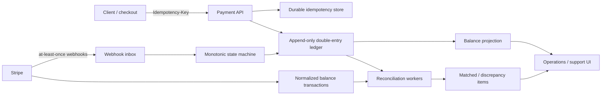
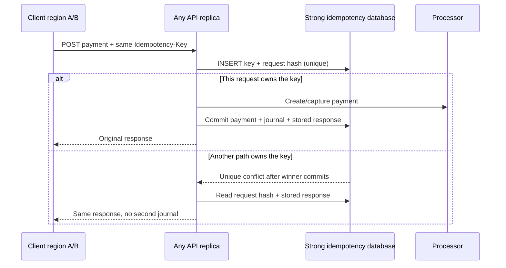
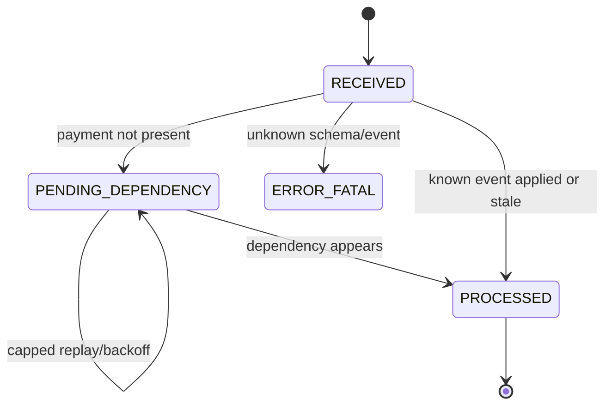
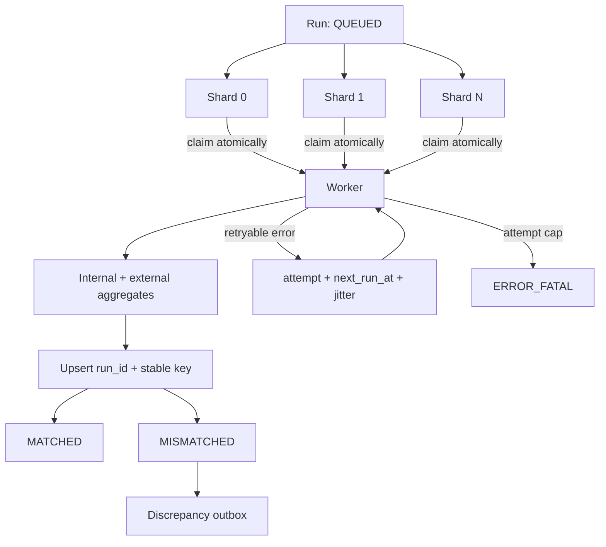

# Architecture

## System context

## Payment write boundary

The idempotency row, payment aggregate, balanced journal, balance projection, and audit record commit in one database transaction. A globally reachable primary database (or consensus-backed distributed SQL) owns the unique idempotency key. Cross-region application replicas do not rely on caches. Concurrent losers read the winner's stored response on retry.

For higher throughput, shard by merchant while routing the same merchant/idempotency key to one home shard. Never asynchronously replicate the uniqueness decision between independent regional primaries: both could charge.

## State and money are separate

Payment state is monotonic (`CREATED < AUTHORIZED/CAPTURE_FAILED < CAPTURED`). Refunds, disputes, fee adjustments, and FX settlement are separate facts and journals, not backward payment transitions. An old `authorized` event after `captured` is retained in the inbox but cannot regress the aggregate.

Each journal has lines that sum to zero per currency. Cross-currency settlement uses separate balanced currency legs plus an FX clearing account; it must not pretend unlike currencies add together.

## Reconciliation data path

1. Land a Stripe report/API page once; retain the raw object and hash.
2. Normalize rows and dedupe on `external_id`, rejecting a changed payload for the same ID.
3. Freeze a run's source watermark and date range.
4. Persist four local shard jobs by hash(match key); production sizing targets at most 10,000 keys/job and can add date buckets.
5. Read daily ledger aggregates and external aggregates, then compare integer minor units.
6. Upsert `(run_id, match_key)` deterministically and checkpoint the shard cursor.
7. Route mismatches to reason-coded review; approved fixes append compensating journals.

At millions/day, partition transaction tables by occurrence date, index `(occurred_at, match_key)`, build incremental daily aggregates, and cap worker concurrency. The sample uses a durable scheduled worker and exposes shard progress.

## Production tables represented in the demo

- `reconciliation_shards(run_id, shard_id, status, cursor, attempt, next_run_at)` with unique `(run_id, shard_id)`.
- `outbox_events` written transactionally for discrepancies and adjustments.
- `external_imports` with file checksum, schema version, accepted and quarantine counts.
- `webhook_event_attempts` for every processing attempt; the inbox row itself remains immutable in a stricter event-sourced variant.

## Deliberate production extension

PostgreSQL date partitions and an incremental daily materialized aggregate are documented deployment migrations rather than forced into the zero-setup H2 profile. The query and stable-key boundaries are already isolated for that replacement.

## Consistency choices

| Decision | Choice | Why |
|---|---|---|
| Charge idempotency | Strong DB uniqueness | Prevent two regional paths from owning one key |
| Webhooks | Dedupe + monotonic transition | Exactly-once transport does not exist |
| Ledger | Immutable double entry | Auditability and correction history |
| Current balance | Transactional projection | Predictable sub-200ms indexed point read |
| Reconciliation | Deterministic snapshot + upsert | Safe resume and replay |
| Corrections | Compensating journal | Never rewrite financial history |
