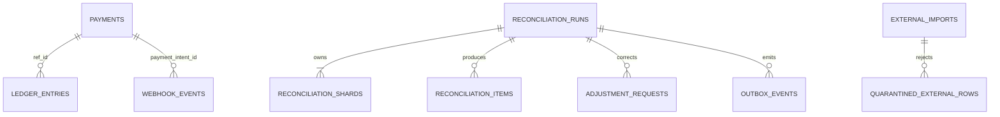

# Data Model and Accounting

Ledger signs are from the platform's perspective. Every journal must sum to zero per currency. A EUR-to-USD settlement is not one mixed-currency journal:

| Journal           | Currency | Debit          | Credit            |
| ----------------- | -------- | -------------- | ----------------- |
| FX order clearing | EUR      | FX clearing    | Stripe receivable |
| FX settlement     | USD      | Processor cash | FX clearing       |

The applied rate and Stripe balance transaction are audit metadata. Later fees and rate corrections append their own journals.

The balance projection is derived state and may be rebuilt; ledger entries are accounting truth. An invariant job should compare projection totals with ledger sums before daily close.
