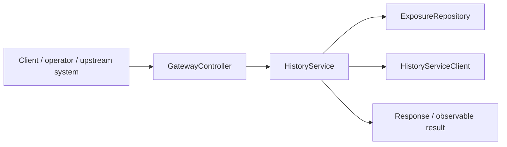
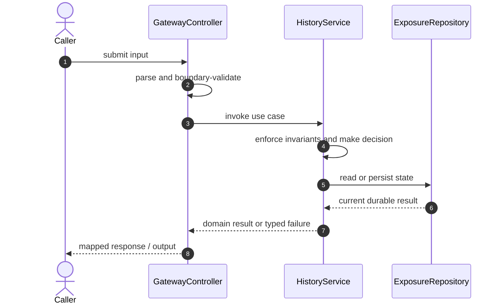

# Trading Risk Platform Code Flow

This is the single code-flow guide for the project. It connects the business request to concrete source files, explains both architectural levels, and shows where validation, state changes, asynchronous work, and responses occur.

## Scope and outcome

A single learning project for backend production fundamentals: HTTP microservices, PostgreSQL persistence, Docker Compose, Kubernetes on Minikube, service discovery, config, secrets, resource limits, and failure drills.

The tracked production-code inventory used by this guide contains **49 source units** and **17 annotation-discovered HTTP operations**. Generated/build output and test sources are intentionally excluded from the runtime path.

## High-Level Design

At the system level, callers enter through an inbound adapter. The adapter owns transport concerns; application/domain code owns use-case decisions; repositories and gateways isolate state and external systems. Asynchronous adapters extend the flow without moving business invariants into controllers or consumers.

### Runtime stages

1. **Enter:** a request, command, scheduled trigger, protocol message, or UI action reaches the inbound boundary.
2. **Validate:** transport shape and required fields are rejected before domain mutation.
3. **Decide:** application/domain logic loads required state and applies invariants, idempotency, authorization, limits, or algorithms.
4. **Commit:** durable state changes pass through a repository/store; external calls pass through gateways; asynchronous work passes through message boundaries.
5. **Return and observe:** the adapter maps the result to an HTTP response, protocol response, CLI output, event, or metric.

## Low-Level Design

The low-level path keeps orchestration directional: inbound adapter → application/domain unit → persistence/outbound adapter. Contracts carry data between layers; configuration and security apply cross-cutting policy without becoming business logic.

### Component map

| Responsibility           | Concrete code                                                                                                                                                                                              |
| ------------------------ | ---------------------------------------------------------------------------------------------------------------------------------------------------------------------------------------------------------- |
| Entry point              | `ApiGatewayApplication`, `HistoryServiceApplication`, `NotificationServiceApplication`, `OrderServiceApplication`, `PreTradeRiskEngineApplication`, `RiskServiceApplication`                               |
| Inbound adapter          | `GatewayController`, `HistoryController`, `AlertController`, `OrderController`, `Handler`, `ApiController`, `RiskController`                                                                               |
| Supporting logic         | `PlatformClients`, `DemoScenario`, `FixMessageParser`, `Models`, `ControlPlane`, `PtrCore`, `PtrRuntime`, `Recovery`, `RiskLimitProperties`, `ExposureSummary`, `OrderSide`, `OrderStatus`, `RiskDecision` |
| Domain/data model        | `ExposureEntity`, `OrderEventEntity`, `AlertRecord`, `OrderEntity`                                                                                                                                         |
| Persistence adapter      | `ExposureRepository`, `OrderEventRepository`, `OrderRepository`                                                                                                                                            |
| Application/domain logic | `HistoryService`, `NotificationService`, `OrderProcessingService`, `PreTradeRiskEngine`, `RiskPolicyService`                                                                                               |
| Outbound adapter         | `HistoryServiceClient`, `NotificationServiceClient`, `RiskServiceClient`, `HistoryServiceClient`                                                                                                           |
| Configuration/security   | `SecurityConfiguration`                                                                                                                                                                                    |
| User interface           | `app`                                                                                                                                                                                                      |
| API/message contract     | `OrderEvent`, `OrderRequest`, `OrderResponse`, `RiskCheckRequest`, `RiskCheckResponse`                                                                                                                     |

### Inbound operations

| Verb/trigger | Path or input                    | Owning code         |
| ------------ | -------------------------------- | ------------------- |
| `POST`       | `/orders`                        | `GatewayController` |
| `GET`        | `/orders/{orderId}`              | `GatewayController` |
| `GET`        | `/exposures`                     | `GatewayController` |
| `GET`        | `/exposures/{clientId}/{symbol}` | `GatewayController` |
| `GET`        | `/alerts`                        | `GatewayController` |
| `POST`       | `/events`                        | `HistoryController` |
| `GET`        | `/exposures/{clientId}/{symbol}` | `HistoryController` |
| `GET`        | `/exposures`                     | `HistoryController` |
| `POST`       | `(class-level/default path)`     | `AlertController`   |
| `GET`        | `(class-level/default path)`     | `AlertController`   |
| `POST`       | `(class-level/default path)`     | `OrderController`   |
| `GET`        | `/{orderId}`                     | `OrderController`   |
| `GET`        | `(class-level/default path)`     | `OrderController`   |
| `POST`       | `/config`                        | `ApiController`     |
| `GET`        | `/operations/runtime`            | `ApiController`     |
| `GET`        | `/internal/runtime`              | `ApiController`     |
| `POST`       | `/check`                         | `RiskController`    |

## Detailed source walkthrough

Read this table top-down by category, then follow the linked files. “Key methods” are discovered from the checked-in implementation and identify useful debugging/interview entry points.

| Source file                                                                                                                                     | Role                     | Responsibility and important methods                                                                                                                                                                                                                 |
| ----------------------------------------------------------------------------------------------------------------------------------------------- | ------------------------ | ---------------------------------------------------------------------------------------------------------------------------------------------------------------------------------------------------------------------------------------------------- |
| [`ApiGatewayApplication.java`](./api-gateway/src/main/java/com/example/risk/gateway/ApiGatewayApplication.java)                                 | Entry point              | ApiGatewayApplication bootstraps the process and wires the runtime. Key methods: `main()`.                                                                                                                                                           |
| [`GatewayController.java`](./api-gateway/src/main/java/com/example/risk/gateway/api/GatewayController.java)                                     | Inbound adapter          | GatewayController accepts an inbound call, validates its boundary contract, and delegates work. Key methods: `submit()`, `order()`, `exposures()`, `exposure()`, `alerts()`.                                                                         |
| [`PlatformClients.java`](./api-gateway/src/main/java/com/example/risk/gateway/client/PlatformClients.java)                                      | Supporting logic         | PlatformClients provides a focused algorithm or shared implementation detail. Key methods: `order()`, `history()`, `notification()`.                                                                                                                 |
| [`HistoryServiceApplication.java`](./history-service/src/main/java/com/example/risk/history/HistoryServiceApplication.java)                     | Entry point              | HistoryServiceApplication bootstraps the process and wires the runtime. Key methods: `main()`.                                                                                                                                                       |
| [`HistoryController.java`](./history-service/src/main/java/com/example/risk/history/api/HistoryController.java)                                 | Inbound adapter          | HistoryController accepts an inbound call, validates its boundary contract, and delegates work. Key methods: `record()`, `exposure()`, `exposures()`.                                                                                                |
| [`ExposureEntity.java`](./history-service/src/main/java/com/example/risk/history/domain/ExposureEntity.java)                                    | Domain/data model        | ExposureEntity represents domain state, identity, or an invariant-bearing value. Key methods: `apply()`, `toSummary()`.                                                                                                                              |
| [`OrderEventEntity.java`](./history-service/src/main/java/com/example/risk/history/domain/OrderEventEntity.java)                                | Domain/data model        | OrderEventEntity represents domain state, identity, or an invariant-bearing value. Key methods: `from()`.                                                                                                                                            |
| [`ExposureRepository.java`](./history-service/src/main/java/com/example/risk/history/repository/ExposureRepository.java)                        | Persistence adapter      | ExposureRepository reads or writes durable state behind a storage boundary.                                                                                                                                                                          |
| [`OrderEventRepository.java`](./history-service/src/main/java/com/example/risk/history/repository/OrderEventRepository.java)                    | Persistence adapter      | OrderEventRepository reads or writes durable state behind a storage boundary.                                                                                                                                                                        |
| [`HistoryService.java`](./history-service/src/main/java/com/example/risk/history/service/HistoryService.java)                                   | Application/domain logic | HistoryService coordinates the use case and enforces domain decisions. Key methods: `record()`, `exposure()`, `exposures()`.                                                                                                                         |
| [`NotificationServiceApplication.java`](./notification-service/src/main/java/com/example/risk/notification/NotificationServiceApplication.java) | Entry point              | NotificationServiceApplication bootstraps the process and wires the runtime. Key methods: `main()`.                                                                                                                                                  |
| [`AlertController.java`](./notification-service/src/main/java/com/example/risk/notification/api/AlertController.java)                           | Inbound adapter          | AlertController accepts an inbound call, validates its boundary contract, and delegates work. Key methods: `publish()`, `recent()`.                                                                                                                  |
| [`AlertRecord.java`](./notification-service/src/main/java/com/example/risk/notification/domain/AlertRecord.java)                                | Domain/data model        | AlertRecord represents domain state, identity, or an invariant-bearing value.                                                                                                                                                                        |
| [`NotificationService.java`](./notification-service/src/main/java/com/example/risk/notification/service/NotificationService.java)               | Application/domain logic | NotificationService coordinates the use case and enforces domain decisions. Key methods: `publish()`, `recent()`.                                                                                                                                    |
| [`OrderServiceApplication.java`](./order-service/src/main/java/com/example/risk/order/OrderServiceApplication.java)                             | Entry point              | OrderServiceApplication bootstraps the process and wires the runtime. Key methods: `main()`.                                                                                                                                                         |
| [`OrderController.java`](./order-service/src/main/java/com/example/risk/order/api/OrderController.java)                                         | Inbound adapter          | OrderController accepts an inbound call, validates its boundary contract, and delegates work. Key methods: `submit()`, `get()`, `list()`.                                                                                                            |
| [`HistoryServiceClient.java`](./order-service/src/main/java/com/example/risk/order/client/HistoryServiceClient.java)                            | Outbound adapter         | HistoryServiceClient calls an external system through an isolated integration boundary. Key methods: `record()`.                                                                                                                                     |
| [`NotificationServiceClient.java`](./order-service/src/main/java/com/example/risk/order/client/NotificationServiceClient.java)                  | Outbound adapter         | NotificationServiceClient calls an external system through an isolated integration boundary. Key methods: `publishAlert()`.                                                                                                                          |
| [`RiskServiceClient.java`](./order-service/src/main/java/com/example/risk/order/client/RiskServiceClient.java)                                  | Outbound adapter         | RiskServiceClient calls an external system through an isolated integration boundary. Key methods: `check()`.                                                                                                                                         |
| [`OrderEntity.java`](./order-service/src/main/java/com/example/risk/order/domain/OrderEntity.java)                                              | Domain/data model        | OrderEntity represents domain state, identity, or an invariant-bearing value. Key methods: `pending()`, `mark()`, `toEvent()`, `getId()`, `getClientId()`, `getSymbol()`.                                                                            |
| [`OrderRepository.java`](./order-service/src/main/java/com/example/risk/order/repository/OrderRepository.java)                                  | Persistence adapter      | OrderRepository reads or writes durable state behind a storage boundary.                                                                                                                                                                             |
| [`OrderProcessingService.java`](./order-service/src/main/java/com/example/risk/order/service/OrderProcessingService.java)                       | Application/domain logic | OrderProcessingService coordinates the use case and enforces domain decisions. Key methods: `submit()`.                                                                                                                                              |
| [`sidecar.py`](./pretrade-risk-engine/sidecar/sidecar.py)                                                                                       | Inbound adapter          | Handler accepts an inbound call, validates its boundary contract, and delegates work.                                                                                                                                                                |
| [`ApiController.java`](./pretrade-risk-engine/src/main/java/com/example/risk/pretrade/ApiController.java)                                       | Inbound adapter          | ApiController accepts an inbound call, validates its boundary contract, and delegates work. Key methods: `configure()`, `runtime()`, `sidecarRuntime()`.                                                                                             |
| [`DemoScenario.java`](./pretrade-risk-engine/src/main/java/com/example/risk/pretrade/DemoScenario.java)                                         | Supporting logic         | DemoScenario provides a focused algorithm or shared implementation detail. Key methods: `run()`.                                                                                                                                                     |
| [`FixMessageParser.java`](./pretrade-risk-engine/src/main/java/com/example/risk/pretrade/FixMessageParser.java)                                 | Supporting logic         | FixMessageParser provides a focused algorithm or shared implementation detail. Key methods: `parse()`, `parseTags()`.                                                                                                                                |
| [`Models.java`](./pretrade-risk-engine/src/main/java/com/example/risk/pretrade/Models.java)                                                     | Supporting logic         | Models provides a focused algorithm or shared implementation detail. Key methods: `fromFix()`, `OrderRequest()`, `notional()`, `FixOrderRequest()`, `MarketPriceRequest()`, `KillSwitchRequest()`.                                                   |
| [`PreTradeRiskEngine.java`](./pretrade-risk-engine/src/main/java/com/example/risk/pretrade/PreTradeRiskEngine.java)                             | Application/domain logic | PreTradeRiskEngine coordinates the use case and enforces domain decisions. Key methods: `reset()`, `submit()`, `fill()`, `updateMarketPrice()`, `setKillSwitch()`, `setCircuitBreaker()`.                                                            |
| [`PreTradeRiskEngineApplication.java`](./pretrade-risk-engine/src/main/java/com/example/risk/pretrade/PreTradeRiskEngineApplication.java)       | Entry point              | PreTradeRiskEngineApplication bootstraps the process and wires the runtime. Key methods: `main()`.                                                                                                                                                   |
| [`SecurityConfiguration.java`](./pretrade-risk-engine/src/main/java/com/example/risk/pretrade/SecurityConfiguration.java)                       | Configuration/security   | SecurityConfiguration defines runtime wiring, authentication, authorization, or cross-cutting policy.                                                                                                                                                |
| [`ControlPlane.java`](./pretrade-risk-engine/src/main/java/com/example/risk/pretrade/ptr/ControlPlane.java)                                     | Supporting logic         | ControlPlane provides a focused algorithm or shared implementation detail. Key methods: `RiskConfig()`, `transition()`, `listen()`, `get()`, `values()`, `put()`.                                                                                    |
| [`PtrCore.java`](./pretrade-risk-engine/src/main/java/com/example/risk/pretrade/ptr/PtrCore.java)                                               | Supporting logic         | PtrCore provides a focused algorithm or shared implementation detail. Key methods: `Order()`, `Decision()`, `CompositeIdentity()`, `retain()`, `release()`, `references()`.                                                                          |
| [`PtrRuntime.java`](./pretrade-risk-engine/src/main/java/com/example/risk/pretrade/ptr/PtrRuntime.java)                                         | Supporting logic         | PtrRuntime provides a focused algorithm or shared implementation detail. Key methods: `submit()`, `write()`, `view()`, `RuntimeView()`, `close()`.                                                                                                   |
| [`Recovery.java`](./pretrade-risk-engine/src/main/java/com/example/risk/pretrade/ptr/Recovery.java)                                             | Supporting logic         | Recovery provides a focused algorithm or shared implementation detail. Key methods: `OrderEvent()`, `EngineSnapshot()`, `append()`, `after()`, `recover()`.                                                                                          |
| [`app.js`](./pretrade-risk-engine/src/main/resources/static/app.js)                                                                             | User interface           | app presents state and initiates user actions.                                                                                                                                                                                                       |
| [`RiskServiceApplication.java`](./risk-service/src/main/java/com/example/risk/risk/RiskServiceApplication.java)                                 | Entry point              | RiskServiceApplication bootstraps the process and wires the runtime. Key methods: `main()`.                                                                                                                                                          |
| [`RiskController.java`](./risk-service/src/main/java/com/example/risk/risk/api/RiskController.java)                                             | Inbound adapter          | RiskController accepts an inbound call, validates its boundary contract, and delegates work. Key methods: `check()`.                                                                                                                                 |
| [`HistoryServiceClient.java`](./risk-service/src/main/java/com/example/risk/risk/client/HistoryServiceClient.java)                              | Outbound adapter         | HistoryServiceClient calls an external system through an isolated integration boundary. Key methods: `exposureFor()`.                                                                                                                                |
| [`RiskLimitProperties.java`](./risk-service/src/main/java/com/example/risk/risk/config/RiskLimitProperties.java)                                | Supporting logic         | RiskLimitProperties provides a focused algorithm or shared implementation detail. Key methods: `getMaxOrderNotional()`, `setMaxOrderNotional()`, `getMaxDailyExposure()`, `setMaxDailyExposure()`, `getMaxOrderQuantity()`, `setMaxOrderQuantity()`. |
| [`RiskPolicyService.java`](./risk-service/src/main/java/com/example/risk/risk/service/RiskPolicyService.java)                                   | Application/domain logic | RiskPolicyService coordinates the use case and enforces domain decisions. Key methods: `check()`.                                                                                                                                                    |
| [`ExposureSummary.java`](./shared/src/main/java/com/example/risk/common/ExposureSummary.java)                                                   | Supporting logic         | ExposureSummary provides a focused algorithm or shared implementation detail. Key methods: `zero()`.                                                                                                                                                 |
| [`OrderEvent.java`](./shared/src/main/java/com/example/risk/common/OrderEvent.java)                                                             | API/message contract     | OrderEvent carries validated data across an API or messaging boundary.                                                                                                                                                                               |
| [`OrderRequest.java`](./shared/src/main/java/com/example/risk/common/OrderRequest.java)                                                         | API/message contract     | OrderRequest carries validated data across an API or messaging boundary. Key methods: `notional()`.                                                                                                                                                  |
| [`OrderResponse.java`](./shared/src/main/java/com/example/risk/common/OrderResponse.java)                                                       | API/message contract     | OrderResponse carries validated data across an API or messaging boundary.                                                                                                                                                                            |
| [`OrderSide.java`](./shared/src/main/java/com/example/risk/common/OrderSide.java)                                                               | Supporting logic         | OrderSide provides a focused algorithm or shared implementation detail.                                                                                                                                                                              |
| [`OrderStatus.java`](./shared/src/main/java/com/example/risk/common/OrderStatus.java)                                                           | Supporting logic         | OrderStatus provides a focused algorithm or shared implementation detail.                                                                                                                                                                            |
| [`RiskCheckRequest.java`](./shared/src/main/java/com/example/risk/common/RiskCheckRequest.java)                                                 | API/message contract     | RiskCheckRequest carries validated data across an API or messaging boundary. Key methods: `notional()`.                                                                                                                                              |
| [`RiskCheckResponse.java`](./shared/src/main/java/com/example/risk/common/RiskCheckResponse.java)                                               | API/message contract     | RiskCheckResponse carries validated data across an API or messaging boundary. Key methods: `accept()`, `reject()`.                                                                                                                                   |
| [`RiskDecision.java`](./shared/src/main/java/com/example/risk/common/RiskDecision.java)                                                         | Supporting logic         | RiskDecision provides a focused algorithm or shared implementation detail.                                                                                                                                                                           |

## End-to-end code-flow narrative

1. Start at `GatewayController`. It receives the external input and should perform only boundary parsing, authentication/authorization handoff, and request validation.
2. Follow the call into `HistoryService`. This is the principal place to explain the use case, invariant checks, deduplication/concurrency decision, and success/failure result.
3. Continue into `ExposureRepository` for the durable or in-memory state transition. Transaction and consistency guarantees belong at this boundary, not in response mapping.
4. This flow completes synchronously; background work is not part of the primary checked-in path.
5. Inspect `HistoryServiceClient` for timeout, retry, circuit-breaking, and external-contract mapping.
6. Return to `GatewayController`, where typed outcomes become the public response or protocol result. Logging and metrics should preserve correlation identifiers without leaking secrets.

## Failure and correctness checkpoints

- **Invalid input:** rejected at the inbound contract before state mutation.
- **Domain conflict:** returned as a typed result; do not hide it as an infrastructure exception.
- **Duplicate or concurrent work:** handled where the project’s idempotency, locking, ordering, or atomic data structure is implemented.
- **Storage/integration failure:** transaction is rolled back or the operation remains safely retryable.
- **Async failure:** consumer retries must preserve idempotency; poison work must become observable rather than loop silently.
- **Observability:** trace the same request/correlation identity through inbound, domain, persistence, and async logs.

## How to trace a scenario in the debugger

1. Choose one operation from the inbound-operations table or the project’s demo script.
2. Break at `GatewayController`, then step into `HistoryService` rather than framework internals.
3. Inspect the command/request object immediately after validation.
4. Stop before and after the call to `ExposureRepository` to compare intended and durable state.
5. If messaging exists, capture the emitted identifier and continue from `the consumer/worker`.
6. Confirm the final public result and the corresponding logs/metrics.

## Related project documentation

- [Project README](./README.md)
- [Specialized diagrams](./docs/DIAGRAMS.md)
- [Interview guide](./docs/INTERVIEW_GUIDE.md)
