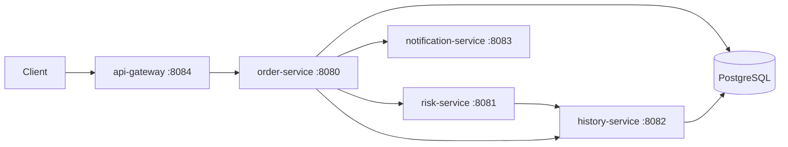
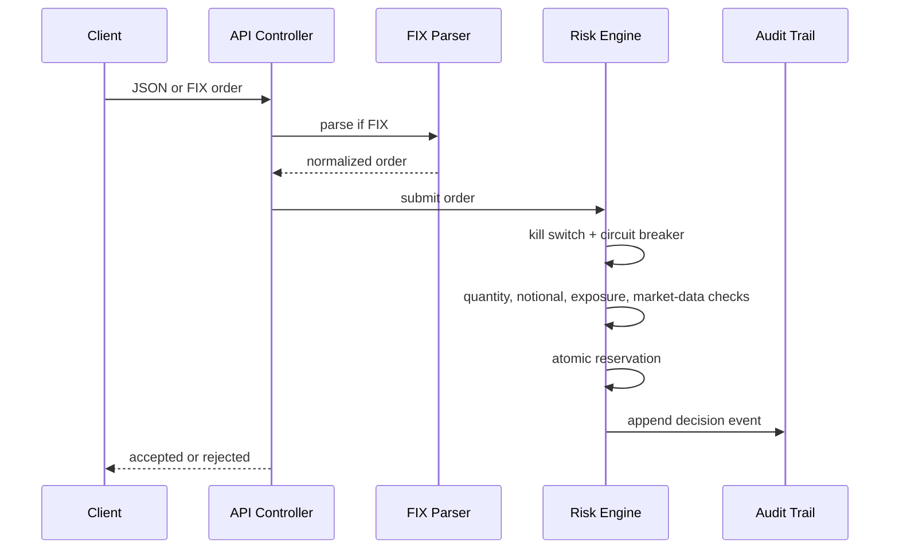
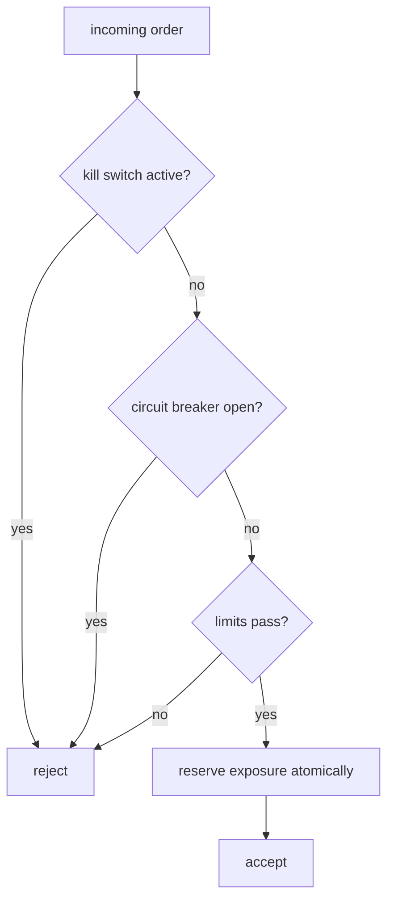

# Trading Risk Platform Diagrams

## High-Level Design

### Microservice View

```mermaid
flowchart LR
    Client["Client"] --> Gateway["api-gateway :8084"]
    Gateway --> Order["order-service :8080"]
    Order --> Risk["risk-service :8081"]
    Risk --> History["history-service :8082"]
    Order --> History
    Order --> Notify["notification-service :8083"]
    Order --> DB[("PostgreSQL")]
    History --> DB
```

## Low-Level Design

### Standalone Pre-Trade Hot Path

```mermaid
sequenceDiagram
    participant C as Client
    participant API as API Controller
    participant Parser as FIX Parser
    participant Engine as Risk Engine
    participant Audit as Audit Trail
    C->>API: JSON or FIX order
    API->>Parser: parse if FIX
    Parser-->>API: normalized order
    API->>Engine: submit order
    Engine->>Engine: kill switch + circuit breaker
    Engine->>Engine: quantity, notional, exposure, market-data checks
    Engine->>Engine: atomic reservation
    Engine->>Audit: append decision event
    API-->>C: accepted or rejected
```

### Risk Decision Flow

```mermaid
flowchart TB
    Order["incoming order"] --> Kill{"kill switch active?"}
    Kill -->|yes| Reject["reject"]
    Kill -->|no| Breaker{"circuit breaker open?"}
    Breaker -->|yes| Reject
    Breaker -->|no| Limits{"limits pass?"}
    Limits -->|no| Reject
    Limits -->|yes| Reserve["reserve exposure atomically"]
    Reserve --> Accept["accept"]
```
