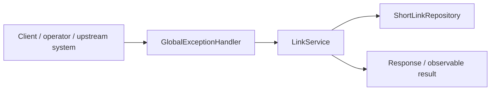
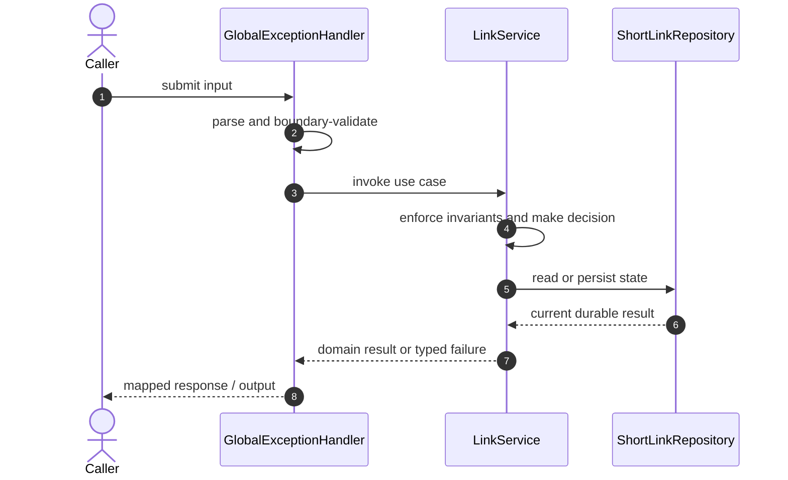

# URL Shortener Code Flow

This is the single code-flow guide for the project. It connects the business request to concrete source files, explains both architectural levels, and shows where validation, state changes, asynchronous work, and responses occur.

## Scope and outcome

A Spring Boot URL shortener with PostgreSQL persistence, Redis-backed rate limiting, redirect tracking, optional expiry, and Docker Compose for local infrastructure.

The tracked production-code inventory used by this guide contains **13 source units** and **3 annotation-discovered HTTP operations**. Generated/build output and test sources are intentionally excluded from the runtime path.

## High-Level Design

At the system level, callers enter through an inbound adapter. The adapter owns transport concerns; application/domain code owns use-case decisions; repositories and gateways isolate state and external systems. Asynchronous adapters extend the flow without moving business invariants into controllers or consumers.

### Runtime stages

1. **Enter:** a request, command, scheduled trigger, protocol message, or UI action reaches the inbound boundary.
2. **Validate:** transport shape and required fields are rejected before domain mutation.
3. **Decide:** application/domain logic loads required state and applies invariants, idempotency, authorization, limits, or algorithms.
4. **Commit:** durable state changes pass through a repository/store; external calls pass through gateways; asynchronous work passes through message boundaries.
5. **Return and observe:** the adapter maps the result to an HTTP response, protocol response, CLI output, event, or metric.

## Low-Level Design

The low-level path keeps orchestration directional: inbound adapter → application/domain unit → persistence/outbound adapter. Contracts carry data between layers; configuration and security apply cross-cutting policy without becoming business logic.

### Component map

| Responsibility           | Concrete code                                                                                                  |
| ------------------------ | -------------------------------------------------------------------------------------------------------------- |
| Entry point              | `UrlShortenerApplication`                                                                                      |
| Supporting logic         | `ApiError`, `ShortLinkNotFoundException`, `UrlCodeGenerator`, `RateLimitExceededException`, `RedisRateLimiter` |
| Inbound adapter          | `GlobalExceptionHandler`, `LinkController`                                                                     |
| API/message contract     | `CreateLinkRequest`, `LinkResponse`                                                                            |
| Application/domain logic | `LinkService`                                                                                                  |
| Domain/data model        | `ShortLink`                                                                                                    |
| Persistence adapter      | `ShortLinkRepository`                                                                                          |

### Inbound operations

| Verb/trigger | Path or input       | Owning code      |
| ------------ | ------------------- | ---------------- |
| `POST`       | `/api/links`        | `LinkController` |
| `GET`        | `/api/links/{code}` | `LinkController` |
| `GET`        | `/{code}`           | `LinkController` |

## Detailed source walkthrough

Read this table top-down by category, then follow the linked files. “Key methods” are discovered from the checked-in implementation and identify useful debugging/interview entry points.

| Source file                                                                                                              | Role                     | Responsibility and important methods                                                                                                                                                  |
| ------------------------------------------------------------------------------------------------------------------------ | ------------------------ | ------------------------------------------------------------------------------------------------------------------------------------------------------------------------------------- |
| [`UrlShortenerApplication.java`](./src/main/java/com/example/capstone/shortener/UrlShortenerApplication.java)            | Entry point              | UrlShortenerApplication bootstraps the process and wires the runtime. Key methods: `main()`.                                                                                          |
| [`ApiError.java`](./src/main/java/com/example/capstone/shortener/error/ApiError.java)                                    | Supporting logic         | ApiError provides a focused algorithm or shared implementation detail. Key methods: `of()`, `withFields()`.                                                                           |
| [`GlobalExceptionHandler.java`](./src/main/java/com/example/capstone/shortener/error/GlobalExceptionHandler.java)        | Inbound adapter          | GlobalExceptionHandler accepts an inbound call, validates its boundary contract, and delegates work. Key methods: `handleNotFound()`, `handleRateLimit()`, `handleValidation()`.      |
| [`CreateLinkRequest.java`](./src/main/java/com/example/capstone/shortener/link/CreateLinkRequest.java)                   | API/message contract     | CreateLinkRequest carries validated data across an API or messaging boundary.                                                                                                         |
| [`LinkController.java`](./src/main/java/com/example/capstone/shortener/link/LinkController.java)                         | Inbound adapter          | LinkController accepts an inbound call, validates its boundary contract, and delegates work. Key methods: `create()`, `get()`, `redirect()`.                                          |
| [`LinkResponse.java`](./src/main/java/com/example/capstone/shortener/link/LinkResponse.java)                             | API/message contract     | LinkResponse carries validated data across an API or messaging boundary. Key methods: `from()`.                                                                                       |
| [`LinkService.java`](./src/main/java/com/example/capstone/shortener/link/LinkService.java)                               | Application/domain logic | LinkService coordinates the use case and enforces domain decisions. Key methods: `create()`, `get()`, `redirect()`.                                                                   |
| [`ShortLink.java`](./src/main/java/com/example/capstone/shortener/link/ShortLink.java)                                   | Domain/data model        | ShortLink represents domain state, identity, or an invariant-bearing value. Key methods: `recordClick()`, `isExpired()`, `getId()`, `getCode()`, `getOriginalUrl()`, `getOwnerKey()`. |
| [`ShortLinkNotFoundException.java`](./src/main/java/com/example/capstone/shortener/link/ShortLinkNotFoundException.java) | Supporting logic         | ShortLinkNotFoundException provides a focused algorithm or shared implementation detail.                                                                                              |
| [`ShortLinkRepository.java`](./src/main/java/com/example/capstone/shortener/link/ShortLinkRepository.java)               | Persistence adapter      | ShortLinkRepository reads or writes durable state behind a storage boundary.                                                                                                          |
| [`UrlCodeGenerator.java`](./src/main/java/com/example/capstone/shortener/link/UrlCodeGenerator.java)                     | Supporting logic         | UrlCodeGenerator provides a focused algorithm or shared implementation detail. Key methods: `uniqueCode()`.                                                                           |
| [`RateLimitExceededException.java`](./src/main/java/com/example/capstone/shortener/rate/RateLimitExceededException.java) | Supporting logic         | RateLimitExceededException provides a focused algorithm or shared implementation detail.                                                                                              |
| [`RedisRateLimiter.java`](./src/main/java/com/example/capstone/shortener/rate/RedisRateLimiter.java)                     | Supporting logic         | RedisRateLimiter provides a focused algorithm or shared implementation detail. Key methods: `allow()`.                                                                                |

## End-to-end code-flow narrative

1. Start at `GlobalExceptionHandler`. It receives the external input and should perform only boundary parsing, authentication/authorization handoff, and request validation.
2. Follow the call into `LinkService`. This is the principal place to explain the use case, invariant checks, deduplication/concurrency decision, and success/failure result.
3. Continue into `ShortLinkRepository` for the durable or in-memory state transition. Transaction and consistency guarantees belong at this boundary, not in response mapping.
4. This flow completes synchronously; background work is not part of the primary checked-in path.
5. External-system behavior is either absent or represented behind another listed adapter.
6. Return to `GlobalExceptionHandler`, where typed outcomes become the public response or protocol result. Logging and metrics should preserve correlation identifiers without leaking secrets.

## Failure and correctness checkpoints

- **Invalid input:** rejected at the inbound contract before state mutation.
- **Domain conflict:** returned as a typed result; do not hide it as an infrastructure exception.
- **Duplicate or concurrent work:** handled where the project’s idempotency, locking, ordering, or atomic data structure is implemented.
- **Storage/integration failure:** transaction is rolled back or the operation remains safely retryable.
- **Async failure:** consumer retries must preserve idempotency; poison work must become observable rather than loop silently.
- **Observability:** trace the same request/correlation identity through inbound, domain, persistence, and async logs.

## How to trace a scenario in the debugger

1. Choose one operation from the inbound-operations table or the project’s demo script.
2. Break at `GlobalExceptionHandler`, then step into `LinkService` rather than framework internals.
3. Inspect the command/request object immediately after validation.
4. Stop before and after the call to `ShortLinkRepository` to compare intended and durable state.
5. If messaging exists, capture the emitted identifier and continue from `the consumer/worker`.
6. Confirm the final public result and the corresponding logs/metrics.

## Related project documentation

- [Project README](./README.md)
- [Specialized diagrams](./docs/DIAGRAMS.md)
- [Interview guide](./docs/INTERVIEW_GUIDE.md)
