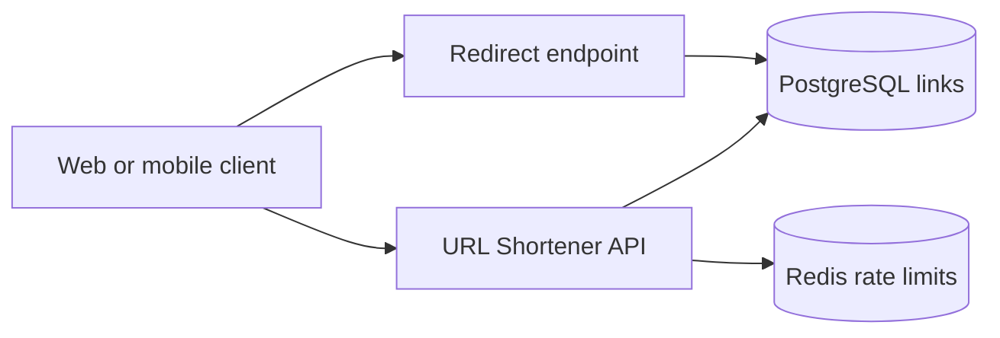
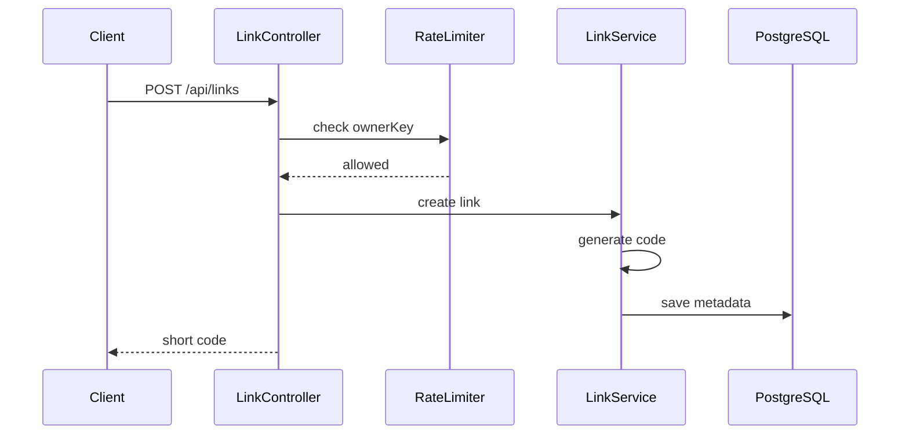
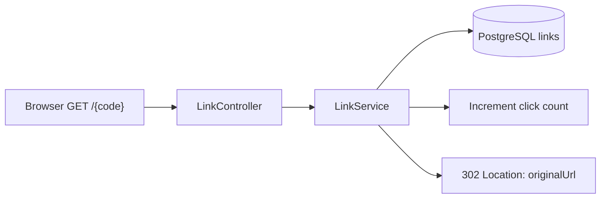
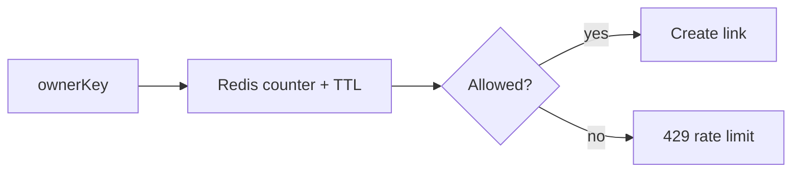

# URL Shortener Diagrams

## High-Level Design

### System Context

```mermaid
flowchart LR
    Client["Web or mobile client"] --> API["URL Shortener API"]
    API --> Links[("PostgreSQL links")]
    API --> Limits[("Redis rate limits")]
    Client --> Redirect["Redirect endpoint"]
    Redirect --> Links
```

## Low-Level Design

### Create Link Flow

```mermaid
sequenceDiagram
    participant C as Client
    participant API as LinkController
    participant R as RateLimiter
    participant S as LinkService
    participant DB as PostgreSQL
    C->>API: POST /api/links
    API->>R: check ownerKey
    R-->>API: allowed
    API->>S: create link
    S->>S: generate code
    S->>DB: save metadata
    API-->>C: short code
```

### Redirect Flow

```mermaid
flowchart LR
    Browser["Browser GET /{code}"] --> Controller["LinkController"]
    Controller --> Service["LinkService"]
    Service --> DB[("PostgreSQL links")]
    Service --> Count["Increment click count"]
    Service --> Redirect["302 Location: originalUrl"]
```

### Abuse-Control View

```mermaid
flowchart LR
    Owner["ownerKey"] --> Redis["Redis counter + TTL"]
    Redis --> Decision{"Allowed?"}
    Decision -->|yes| Create["Create link"]
    Decision -->|no| Reject["429 rate limit"]
```
