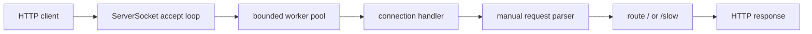
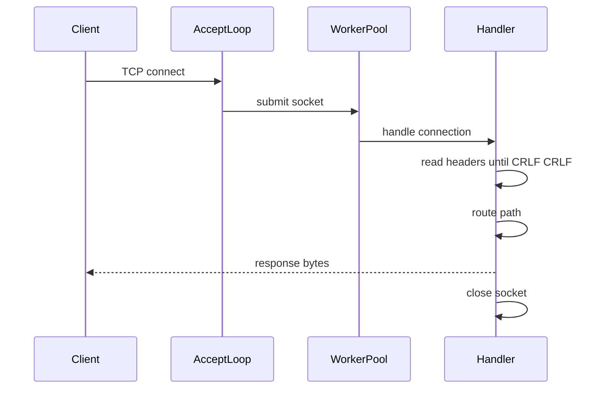
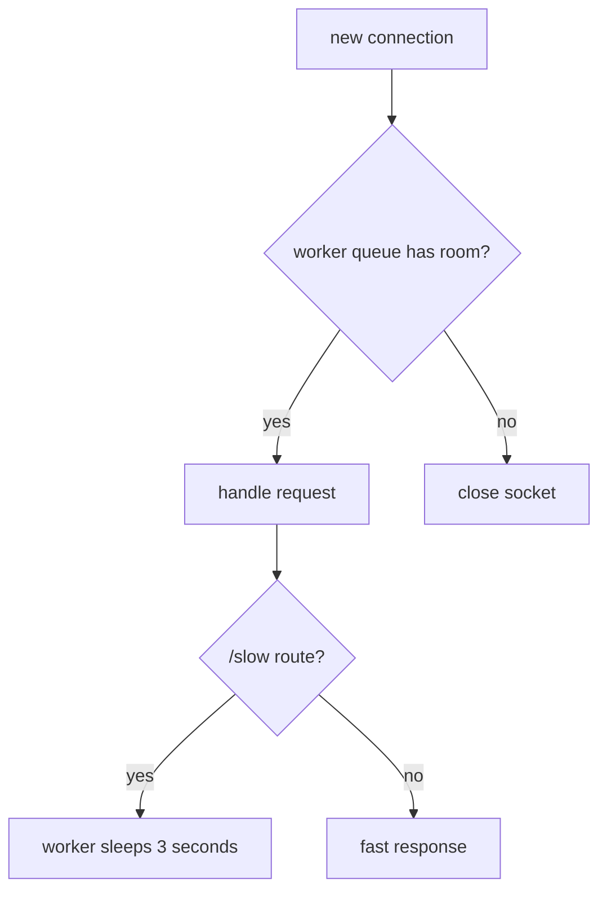

# Web Server Lab Diagrams

## High-Level Design

### Component View

```mermaid
flowchart LR
    Client["HTTP client"] --> Socket["ServerSocket accept loop"]
    Socket --> Pool["bounded worker pool"]
    Pool --> Handler["connection handler"]
    Handler --> Parser["manual request parser"]
    Parser --> Router["route / or /slow"]
    Router --> Response["HTTP response"]
```

## Low-Level Design

### Request Flow

```mermaid
sequenceDiagram
    participant C as Client
    participant A as AcceptLoop
    participant P as WorkerPool
    participant H as Handler
    C->>A: TCP connect
    A->>P: submit socket
    P->>H: handle connection
    H->>H: read headers until CRLF CRLF
    H->>H: route path
    H-->>C: response bytes
    H->>H: close socket
```

### Overload Flow

```mermaid
flowchart TB
    Conn["new connection"] --> Queue{"worker queue has room?"}
    Queue -->|yes| Handle["handle request"]
    Queue -->|no| Close["close socket"]
    Handle --> Slow{"/slow route?"}
    Slow -->|yes| Sleep["worker sleeps 3 seconds"]
    Slow -->|no| Fast["fast response"]
```
